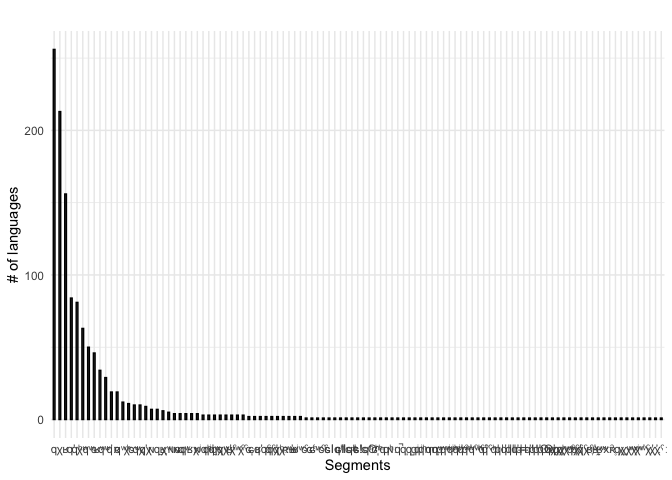
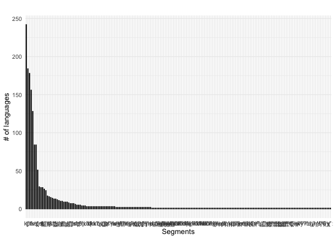
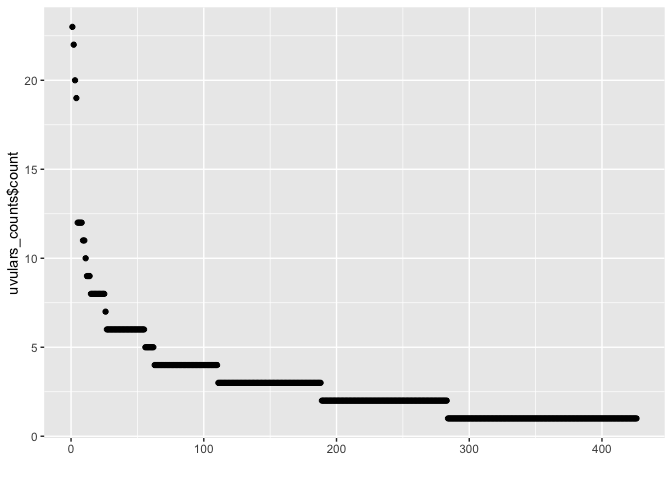
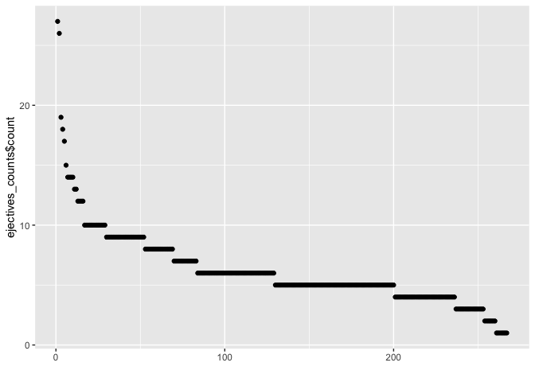

PHOIBLE uvular and ejective consonants
================
Steven Moran
(21 November, 2020)

# Overview

This report extracts
[uvulars](https://en.wikipedia.org/wiki/Uvular_consonant) and
[ejectives](https://en.wikipedia.org/wiki/Ejective_consonant) from
[PHOIBLE](https://phoible.org/) (Moran and McCloy 2019).

The output data format for uvulars and ejectives data is a
[CSV](https://en.wikipedia.org/wiki/Comma-separated_values) file with
the following columns:

    InventoryID | Glottocode | ... | Uvulars | Ejectives | Marginal_Uvular | ...
    1 | aaaa1111 | ... | 2 | 4 | 1 | ...

For uvulars, we extract consonants of all manners of articulation
(rather than just stops). For ejectives, we extract all places of
articulation.

The final data file is available in the
[uvulars\_ejectives\_pruned2.csv](../Data/uvulars_ejectives_pruned2.csv)
file. Here we also add Urban’s extended macroareas.

## Data preparation

This report uses these [R](https://cran.r-project.org/) libraries
(Wickham et al. 2019,@knitr):

    library(tidyverse)
    library(knitr)

Get the PHOIBLE data and merge in the metadata from
[Glottolog](https://glottolog.org/) (Hammarström et al. 2020).

PHOIBLE data is released periodically be version because the editors add
new data, make reported corrections, etc. Here we use the PHOIBLE dev
version from [May
2020](https://github.com/phoible/dev/tree/646f5e4f64bfefb7868bf4a3b65bcd1da243976a).

    phoible <- read_csv(url("https://github.com/phoible/dev/blob/646f5e4f64bfefb7868bf4a3b65bcd1da243976a/data/phoible.csv?raw=true"), 
                        col_types = c(InventoryID = "i", Marginal = "l", .default = "c"))

Merge in [Glottolog 4.1](https://glottolog.org/meta/downloads) data.

    languoids <- read.csv("glottolog_languoid.csv/languoid.csv", stringsAsFactors = FALSE)
    geo <- read.csv("languages_and_dialects_geo.csv", stringsAsFactors = FALSE)
    phoible <- left_join(phoible, languoids, by = c("Glottocode" = "id"))
    phoible <- left_join(phoible, geo)

    ## Joining, by = c("name", "level", "latitude", "longitude")

    rm(geo, languoids)

Create a PHOIBLE index.

    index <- phoible %>%
      select(InventoryID, Glottocode, ISO6393, name, LanguageName, SpecificDialect, Source, family_id, level, status, latitude, longitude, country_ids, macroarea) %>%
      distinct()

    index <- index %>% rename(GlottologName = name, PhoibleName = LanguageName)

Get uvular consonant counts and their number of marginals.

    uvulars <- phoible %>% filter(grepl("q|ɢ|ɴ|ʀ|χ|ʁ|ʛ|ʟ̠", Phoneme))
    uvular_counts <- uvulars %>%
      group_by(InventoryID) %>%
      summarize(Uvulars = n())

    ## `summarise()` ungrouping output (override with `.groups` argument)

    uvular_marginals <- uvulars %>%
      filter(Marginal) %>%
      group_by(InventoryID) %>%
      summarize(Marginal_Uvular = n())

    ## `summarise()` ungrouping output (override with `.groups` argument)

Let’s write the uvular data to disk, so that we can use it to [remove
the rhotics](remove_uvular_rhotics.Rmd), as suggested by a reviewer.

    write_csv(uvulars, 'uvulars.csv')

We note here that these are the languages that contain uvular rhotics.
There are 22 occurrences out of 1255 observations.

    uvulars %>% filter(grepl('ʀ', Phoneme)) %>% select(InventoryID, Glottocode, LanguageName, SpecificDialect, Phoneme, Allophones, Marginal) %>% kable()

| InventoryID | Glottocode | LanguageName     | SpecificDialect                                                                                              | Phoneme | Allophones | Marginal |
|------------:|:-----------|:-----------------|:-------------------------------------------------------------------------------------------------------------|:--------|:-----------|:---------|
|          33 | bata1289   | Batak            | NA                                                                                                           | ʀ       | ʀ          | NA       |
|         161 | stan1295   | German           | NA                                                                                                           | ʀ       | ʌ ʌ̯ ʀ r    | NA       |
|         162 | stan1290   | French           | NA                                                                                                           | ʀ       | ʀ ʁ̞ ʀ̥      | NA       |
|         241 | bata1289   | BATAK            | NA                                                                                                           | ʀ       | NA         | TRUE     |
|         304 | stan1295   | GERMAN           | NA                                                                                                           | ʀ       | NA         | FALSE    |
|         331 | stan1290   | FRENCH           | NA                                                                                                           | ʀ       | NA         | FALSE    |
|         459 | mogh1245   | MOGHOL           | NA                                                                                                           | ʀ       | NA         | FALSE    |
|        1049 | east2295   | Standard Yiddish | NA                                                                                                           | ʀ       | ʀ          | FALSE    |
|        1050 | dutc1256   | Dutch            | Belgian Standard                                                                                             | ʀ       | ʀ r        | FALSE    |
|        1610 | siwi1239   | Siwi             | NA                                                                                                           | ʀ       | ʀ          | FALSE    |
|        1837 | xiri1243   | Xiriâna          | NA                                                                                                           | ʀ       | NA         | NA       |
|        1874 | japr1238   | Japreria         | NA                                                                                                           | ʀ       | NA         | NA       |
|        2157 | stan1318   | Arabic           | Safad, Beirut, Damascus, Kuwait                                                                              | xʀ̥      | xʀ̥         | FALSE    |
|        2171 | dutc1256   | Dutch            | the dialect of Maastricht (south-eastern dialect group; Central Limburgian)                                  | ʀʁ      | ʀʁ ʀ̥ʁ̥      | FALSE    |
|        2172 | dutc1256   | Dutch            | the Dutch dialect of Weert (West-Limburgian), rural variety (not Stadsweerts)                                | ʀʁ      | ʀʁ ʀ̥ʁ̥      | FALSE    |
|        2173 | dutc1256   | Dutch            | the Belgian Limburg dialect of Hamont (belongs to the West Limburg dialects, subclassification: Dommellands) | ʀ       | ʀ χ        | FALSE    |
|        2200 | luxe1241   | Luxembourgish    | Standard central Luxembourgish                                                                               | ʀ       | ʀ ʁ ə ɐ χ  | FALSE    |
|        2272 | swis1247   | Zurich German    | NA                                                                                                           | ʀ       | NA         | FALSE    |
|        2337 | luxe1241   | Luxembourgish    | NA                                                                                                           | ʀ       | NA         | FALSE    |
|        2398 | stan1295   | German           | German (Standard)                                                                                            | ʀ       | NA         | FALSE    |
|        2399 | east2295   | Eastern Yiddish  | Eastern Yiddish (Central)                                                                                    | ʀ       | NA         | FALSE    |
|        2540 | kara1462   | Tofa             | NA                                                                                                           | ʀ       | NA         | FALSE    |

We also note that the PHOIBLE features +dorsal and +back do not capture
uvulars that are palatalized (negates \[back\]), hence the use of
regular expression search above.

    t1 <- uvulars %>%
      select(Phoneme) %>%
      distinct()
    "χʲ" %in% t1$Phoneme

    ## [1] TRUE

    t2 <- phoible %>%
      filter(back == "+" & dorsal == "+") %>%
      select(Phoneme) %>%
      distinct()
    "χʲ" %in% t2$Phoneme

    ## [1] FALSE

    setdiff(t1$Phoneme, t2$Phoneme)

    ##  [1] "qǀ"   "qǀʼ"  "qǁ"   "qǁʼ"  "qǂ"   "qǂʼ"  "qǃ"   "qǃʼ"  "qʘ"   "qʘʼ" 
    ## [11] "ɢǀ"   "ɢǀqʰ" "ɢǁ"   "ɢǁqʰ" "ɢǂ"   "ɢǃ"   "ɢǃqʰ" "ɢʘ"   "qm"   "qn"  
    ## [21] "xʀ̥"   "χʲ"   "qʲʼ"  "ʁʲ"   "qʲ"   "qʲʰ"  "qʷʲ"  "qʷʲʰ" "qʷʲʼ" "χʷʲ"

    rm(t1, t2)

Get ejectives counts and their number of marginals.

    ejectives <- phoible %>% filter(grepl("ʼ", Phoneme))
    ejective_counts <- ejectives %>%
      group_by(InventoryID) %>%
      summarize(Ejectives = n())

    ## `summarise()` ungrouping output (override with `.groups` argument)

    ejective_marginals <- ejectives %>%
      filter(Marginal) %>%
      group_by(InventoryID) %>%
      summarize(Marginal_Ejective = n())

    ## `summarise()` ungrouping output (override with `.groups` argument)

Join the data frames.

    df <- left_join(index, uvular_counts)

    ## Joining, by = "InventoryID"

    df <- left_join(df, uvular_marginals)

    ## Joining, by = "InventoryID"

    df <- left_join(df, ejective_counts)

    ## Joining, by = "InventoryID"

    df <- left_join(df, ejective_marginals)

    ## Joining, by = "InventoryID"

    rm(ejective_counts, ejective_marginals, uvular_counts, uvular_marginals)

Write the results to disk.

    write_csv(df, "uvulars_ejectives.csv")

## Exploratory

Have a look at the data.

    df %>%
      head() %>%
      kable()

| InventoryID | Glottocode | ISO6393 | GlottologName | PhoibleName | SpecificDialect | Source | family\_id | level    | status                | latitude | longitude | country\_ids      | macroarea | Uvulars | Marginal\_Uvular | Ejectives | Marginal\_Ejective |
|------------:|:-----------|:--------|:--------------|:------------|:----------------|:-------|:-----------|:---------|:----------------------|---------:|----------:|:------------------|:----------|--------:|-----------------:|----------:|-------------------:|
|           1 | kore1280   | kor     | Korean        | Korean      | NA              | spa    | kore1284   | language | safe                  |  37.5000 | 128.00000 | CN KP KR RU       | Eurasia   |      NA |               NA |        NA |                 NA |
|           2 | kett1243   | ket     | Ket           | Ket         | NA              | spa    | yeni1252   | language | definitely endangered |  63.7551 |  87.54660 | RU                | Eurasia   |       1 |               NA |        NA |                 NA |
|           3 | lakk1252   | lbe     | Lak           | Lak         | NA              | spa    | nakh1245   | language | vulnerable            |  42.1328 |  47.08090 | AZ GE KZ RU UA    | Eurasia   |      12 |               NA |        10 |                 NA |
|           4 | kaba1278   | kbd     | Kabardian     | Kabardian   | NA              | spa    | abkh1242   | language | vulnerable            |  43.5082 |  43.39180 | RU TR             | Eurasia   |       8 |               NA |        10 |                 NA |
|           5 | nucl1302   | kat     | Georgian      | Georgian    | NA              | spa    | kart1248   | language | safe                  |  41.8504 |  43.78613 | AM AZ GE IR RU TR | Eurasia   |       3 |               NA |         6 |                 NA |
|           6 | buru1296   | bsk     | Burushaski    | Burushaski  | NA              | spa    |            | language | definitely endangered |  36.2161 |  74.82360 | IN PK             | Eurasia   |       4 |               NA |        NA |                 NA |

Do any languages contain uvulars that are always marginal? Yes.

    kable(df[which(df$Uvulars == df$Marginal_Uvular), ])

| InventoryID | Glottocode | ISO6393 | GlottologName     | PhoibleName          | SpecificDialect | Source | family\_id | level    | status                |  latitude |  longitude | country\_ids      | macroarea     | Uvulars | Marginal\_Uvular | Ejectives | Marginal\_Ejective |
|------------:|:-----------|:--------|:------------------|:---------------------|:----------------|:-------|:-----------|:---------|:----------------------|----------:|-----------:|:------------------|:--------------|--------:|-----------------:|----------:|-------------------:|
|         241 | bata1289   | bbc     | Batak Toba        | BATAK                | NA              | upsid  | aust1307   | language | vulnerable            |  2.354980 |   99.17610 | ID                | Papunesia     |       1 |                1 |        NA |                 NA |
|         306 | kumi1248   | dih     | Tipai             | DIEGUENO             | NA              | upsid  | coch1271   | language | severely endangered   | 32.331000 | -116.60400 | MX US             | North America |       1 |                1 |        NA |                 NA |
|         321 | basq1248   | eus     | Basque            | BASQUE               | NA              | upsid  |            | language | vulnerable            | 43.278700 |   -1.31622 | ES FR             | Eurasia       |       1 |                1 |        NA |                 NA |
|         354 | hind1269   | hin     | Hindi             | HINDI-URDU           | NA              | upsid  | indo1319   | language | safe                  | 25.000000 |   77.00000 | BD BT IN NP       | Eurasia       |       3 |                3 |        NA |                 NA |
|         967 | nubi1253   | kcn     | Nubi              | Nubi                 | NA              | ph     | afro1255   | language | definitely endangered | -0.183215 |   34.75520 | KE UG US          | Africa        |       1 |                1 |        NA |                 NA |
|        1036 | phal1254   | phl     | Phalura           | Palula (Phalura)     | NA              | ph     | indo1319   | language | vulnerable            | 35.509600 |   71.84210 | PK                | NA            |       1 |                1 |        NA |                 NA |
|        1241 | adam1253   | fub     | Adamawa Fulfulde  | Fulfulde (Cameroon)  | CAM             | gm     | atla1278   | language | safe                  |  8.140326 |   13.07734 | CM ER ET NG SD TD | Africa        |       1 |                1 |        NA |                 NA |
|        2227 | sout2672   | psi     | Southeast Pashayi | Southeastern Pashayi | NA              | uz     | indo1319   | language | vulnerable            | 34.430990 |   70.30351 | AF                | Eurasia       |       1 |                1 |        NA |                 NA |

    kable(phoible %>% select(InventoryID, Glottocode, LanguageName, Phoneme) %>% filter(InventoryID == 354) %>% filter(grepl("q|ɢ|ɴ|ʀ|χ|ʁ|ʛ|ʟ̠", Phoneme)))

| InventoryID | Glottocode | LanguageName | Phoneme |
|------------:|:-----------|:-------------|:--------|
|         354 | hind1269   | HINDI-URDU   | q       |
|         354 | hind1269   | HINDI-URDU   | ʁ       |
|         354 | hind1269   | HINDI-URDU   | χ       |

Do any languages contain ejectives that are always marginal? Yes.

    kable(df[which(df$Ejectives == df$Marginal_Ejective), ])

| InventoryID | Glottocode | ISO6393 | GlottologName | PhoibleName | SpecificDialect | Source | family\_id | level   | status | latitude | longitude | country\_ids | macroarea | Uvulars | Marginal\_Uvular | Ejectives | Marginal\_Ejective |
|------------:|:-----------|:--------|:--------------|:------------|:----------------|:-------|:-----------|:--------|:-------|---------:|----------:|:-------------|:----------|--------:|-----------------:|----------:|-------------------:|
|        1276 | ikal1242   | kck     | Ikalanga      | Ikalanga    | NA              | gm     | atla1278   | dialect | safe   |       NA |        NA |              | Africa    |      NA |               NA |         1 |                  1 |

    kable(phoible %>% select(InventoryID, Glottocode, LanguageName, Phoneme) %>% filter(InventoryID == 1276) %>% filter(grepl("ʼ", Phoneme)))

| InventoryID | Glottocode | LanguageName | Phoneme |
|------------:|:-----------|:-------------|:--------|
|        1276 | ikal1242   | Ikalanga     | t̠ʃʼ     |

How many Glottocodes are there in phoible?

    nrow(phoible %>% select(Glottocode) %>% distinct())

    ## [1] 2177

How many phoible inventories have uvular consonants?

    nrow(uvulars %>% select(InventoryID) %>% distinct())

    ## [1] 426

How many are marginal?

    nrow(uvulars %>% filter(Marginal) %>% group_by(InventoryID, Marginal)) # 21 rows

    ## [1] 21

    kable(uvulars %>% filter(Marginal) %>% group_by(InventoryID, Marginal))

| InventoryID | Glottocode | ISO6393 | LanguageName         | SpecificDialect | GlyphID   | Phoneme | Allophones | Marginal | SegmentClass | Source | tone | stress | syllabic | short | long | consonantal | sonorant | continuant | delayedRelease | approximant | tap | trill | nasal | lateral | labial | round | labiodental | coronal | anterior | distributed | strident | dorsal | high | low | front | back | tense | retractedTongueRoot | advancedTongueRoot | periodicGlottalSource | epilaryngealSource | spreadGlottis | constrictedGlottis | fortis | raisedLarynxEjective | loweredLarynxImplosive | click | family\_id | parent\_id | name                 | bookkeeping | level    | status                |  latitude |  longitude | iso639P3code | description | markup\_description | child\_family\_count | child\_language\_count | child\_dialect\_count | country\_ids      | glottocode | isocodes | macroarea     |
|------------:|:-----------|:--------|:---------------------|:----------------|:----------|:--------|:-----------|:---------|:-------------|:-------|:-----|:-------|:---------|:------|:-----|:------------|:---------|:-----------|:---------------|:------------|:----|:------|:------|:--------|:-------|:------|:------------|:--------|:---------|:------------|:---------|:-------|:-----|:----|:------|:-----|:------|:--------------------|:-------------------|:----------------------|:-------------------|:--------------|:-------------------|:-------|:---------------------|:-----------------------|:------|:-----------|:-----------|:---------------------|:------------|:---------|:----------------------|----------:|-----------:|:-------------|:------------|:--------------------|---------------------:|-----------------------:|----------------------:|:------------------|:-----------|:---------|:--------------|
|         231 | egyp1253   | arz     | ARABIC               | NA              | 0071      | q       | NA         | TRUE     | consonant    | upsid  | 0    | \-     | \-       | \-    | \-   | \+          | \-       | \-         | \-             | \-          | \-  | \-    | \-    | \-      | \-     | 0     | 0           | \-      | 0        | 0           | 0        | \+     | \-   | \-  | \-    | \+   | 0     | 0                   | 0                  | \-                    | \-                 | \-            | \-                 | \-     | \-                   | \-                     | \-    | afro1255   | egyp1254   | Egyptian Arabic      | False       | language | safe                  | 31.000000 |   31.00000 | arz          | NA          | NA                  |                    0 |                      0 |                     3 | EG IL LY          | egyp1253   | arz      | Africa        |
|         241 | bata1289   | bbc     | BATAK                | NA              | 0280      | ʀ       | NA         | TRUE     | consonant    | upsid  | 0    | \-     | \-       | \-    | \-   | \+          | \+       | \+         | 0              | \+          | \-  | \+    | \-    | \-      | \-     | 0     | 0           | \-      | 0        | 0           | 0        | \+     | \-   | \-  | \-    | \+   | 0     | 0                   | 0                  | \+                    | \-                 | \-            | \-                 | \-     | \-                   | \-                     | \-    | aust1307   | sout2849   | Batak Toba           | False       | language | vulnerable            |  2.354980 |   99.17610 | bbc          | NA          | NA                  |                    0 |                      0 |                     0 | ID                | bata1289   | bbc      | Papunesia     |
|         264 | buru1296   | bsk     | BURUSHASKI           | NA              | 03C7      | χ       | NA         | TRUE     | consonant    | upsid  | 0    | \-     | \-       | \-    | \-   | \+          | \-       | \+         | \+             | \-          | \-  | \-    | \-    | \-      | \-     | 0     | 0           | \-      | 0        | 0           | 0        | \+     | \-   | \-  | \-    | \+   | 0     | 0                   | 0                  | \-                    | \-                 | \-            | \-                 | \-     | \-                   | \-                     | \-    |            |            | Burushaski           | False       | language | definitely endangered | 36.216100 |   74.82360 | bsk          | NA          | NA                  |                    0 |                      0 |                     3 | IN PK             | buru1296   | bsk      | Eurasia       |
|         306 | kumi1248   | dih     | DIEGUENO             | NA              | 0071      | q       | NA         | TRUE     | consonant    | upsid  | 0    | \-     | \-       | \-    | \-   | \+          | \-       | \-         | \-             | \-          | \-  | \-    | \-    | \-      | \-     | 0     | 0           | \-      | 0        | 0           | 0        | \+     | \-   | \-  | \-    | \+   | 0     | 0                   | 0                  | \-                    | \-                 | \-            | \-                 | \-     | \-                   | \-                     | \-    | coch1271   | dieg1234   | Tipai                | False       | language | severely endangered   | 32.331000 | -116.60400 | dih          | NA          | NA                  |                    0 |                      0 |                     0 | MX US             | kumi1248   | dih      | North America |
|         321 | basq1248   | eus     | BASQUE               | NA              | 03C7      | χ       | NA         | TRUE     | consonant    | upsid  | 0    | \-     | \-       | \-    | \-   | \+          | \-       | \+         | \+             | \-          | \-  | \-    | \-    | \-      | \-     | 0     | 0           | \-      | 0        | 0           | 0        | \+     | \-   | \-  | \-    | \+   | 0     | 0                   | 0                  | \-                    | \-                 | \-            | \-                 | \-     | \-                   | \-                     | \-    |            |            | Basque               | False       | language | vulnerable            | 43.278700 |   -1.31622 | eus          | NA          | NA                  |                    0 |                      0 |                    11 | ES FR             | basq1248   | eus      | Eurasia       |
|         354 | hind1269   | hin     | HINDI-URDU           | NA              | 0071      | q       | NA         | TRUE     | consonant    | upsid  | 0    | \-     | \-       | \-    | \-   | \+          | \-       | \-         | \-             | \-          | \-  | \-    | \-    | \-      | \-     | 0     | 0           | \-      | 0        | 0           | 0        | \+     | \-   | \-  | \-    | \+   | 0     | 0                   | 0                  | \-                    | \-                 | \-            | \-                 | \-     | \-                   | \-                     | \-    | indo1319   | hind1270   | Hindi                | False       | language | safe                  | 25.000000 |   77.00000 | hin          | NA          | NA                  |                    0 |                      0 |                     4 | BD BT IN NP       | hind1269   | hin      | Eurasia       |
|         354 | hind1269   | hin     | HINDI-URDU           | NA              | 0281      | ʁ       | NA         | TRUE     | consonant    | upsid  | 0    | \-     | \-       | \-    | \-   | \+          | \-       | \+         | \+             | \-          | \-  | \-    | \-    | \-      | \-     | 0     | 0           | \-      | 0        | 0           | 0        | \+     | \-   | \-  | \-    | \+   | 0     | 0                   | 0                  | \+                    | \-                 | \-            | \-                 | \-     | \-                   | \-                     | \-    | indo1319   | hind1270   | Hindi                | False       | language | safe                  | 25.000000 |   77.00000 | hin          | NA          | NA                  |                    0 |                      0 |                     4 | BD BT IN NP       | hind1269   | hin      | Eurasia       |
|         354 | hind1269   | hin     | HINDI-URDU           | NA              | 03C7      | χ       | NA         | TRUE     | consonant    | upsid  | 0    | \-     | \-       | \-    | \-   | \+          | \-       | \+         | \+             | \-          | \-  | \-    | \-    | \-      | \-     | 0     | 0           | \-      | 0        | 0           | 0        | \+     | \-   | \-  | \-    | \+   | 0     | 0                   | 0                  | \-                    | \-                 | \-            | \-                 | \-     | \-                   | \-                     | \-    | indo1319   | hind1270   | Hindi                | False       | language | safe                  | 25.000000 |   77.00000 | hin          | NA          | NA                  |                    0 |                      0 |                     4 | BD BT IN NP       | hind1269   | hin      | Eurasia       |
|         500 | nuuc1236   | nuk     | TSESHAHT             | NA              | 0071+02B7 | qʷ      | NA         | TRUE     | consonant    | upsid  | 0    | \-     | \-       | \-    | \-   | \+          | \-       | \-         | \-             | \-          | \-  | \-    | \-    | \-      | \+     | \+    | \-          | \-      | 0        | 0           | 0        | \+     | \-   | \-  | \-    | \+   | 0     | 0                   | 0                  | \-                    | \-                 | \-            | \-                 | \-     | \-                   | \-                     | \-    | waka1280   | noot1238   | Nuu-chah-nulth       | False       | language | critically endangered | 49.670000 | -126.67000 | nuk          | NA          | NA                  |                    0 |                      0 |                     0 | US                | nuuc1236   | nuk      | North America |
|         500 | nuuc1236   | nuk     | TSESHAHT             | NA              | 0071+02BC | qʼ      | NA         | TRUE     | consonant    | upsid  | 0    | \-     | \-       | \-    | \-   | \+          | \-       | \-         | \-             | \-          | \-  | \-    | \-    | \-      | \-     | 0     | 0           | \-      | 0        | 0           | 0        | \+     | \-   | \-  | \-    | \+   | 0     | 0                   | 0                  | \-                    | \-                 | \-            | \+                 | \-     | \+                   | \-                     | \-    | waka1280   | noot1238   | Nuu-chah-nulth       | False       | language | critically endangered | 49.670000 | -126.67000 | nuk          | NA          | NA                  |                    0 |                      0 |                     0 | US                | nuuc1236   | nuk      | North America |
|         500 | nuuc1236   | nuk     | TSESHAHT             | NA              | 03C7      | χ       | NA         | TRUE     | consonant    | upsid  | 0    | \-     | \-       | \-    | \-   | \+          | \-       | \+         | \+             | \-          | \-  | \-    | \-    | \-      | \-     | 0     | 0           | \-      | 0        | 0           | 0        | \+     | \-   | \-  | \-    | \+   | 0     | 0                   | 0                  | \-                    | \-                 | \-            | \-                 | \-     | \-                   | \-                     | \-    | waka1280   | noot1238   | Nuu-chah-nulth       | False       | language | critically endangered | 49.670000 | -126.67000 | nuk          | NA          | NA                  |                    0 |                      0 |                     0 | US                | nuuc1236   | nuk      | North America |
|         500 | nuuc1236   | nuk     | TSESHAHT             | NA              | 03C7+02B7 | χʷ      | NA         | TRUE     | consonant    | upsid  | 0    | \-     | \-       | \-    | \-   | \+          | \-       | \+         | \+             | \-          | \-  | \-    | \-    | \-      | \+     | \+    | \-          | \-      | 0        | 0           | 0        | \+     | \-   | \-  | \-    | \+   | 0     | 0                   | 0                  | \-                    | \-                 | \-            | \-                 | \-     | \-                   | \-                     | \-    | waka1280   | noot1238   | Nuu-chah-nulth       | False       | language | critically endangered | 49.670000 | -126.67000 | nuk          | NA          | NA                  |                    0 |                      0 |                     0 | US                | nuuc1236   | nuk      | North America |
|         862 | barb1263   | boi     | Barbareño            | NA              | 0071+02B0 | qʰ      | qʰ         | TRUE     | consonant    | ph     | 0    | \-     | \-       | \-    | \-   | \+          | \-       | \-         | \-             | \-          | \-  | \-    | \-    | \-      | \-     | 0     | 0           | \-      | 0        | 0           | 0        | \+     | \-   | \-  | \-    | \+   | 0     | 0                   | 0                  | \-                    | \-                 | \+            | \-                 | \-     | \-                   | \-                     | \-    | chum1262   | cent2139   | Barbareño            | False       | language | extinct               | 34.462000 | -119.69900 | boi          | NA          | NA                  |                    0 |                      0 |                     0 | US                | barb1263   | boi      | North America |
|         919 | kusu1250   | kgg     | Kusunda              | NA              | 03C7      | χ       | χ          | TRUE     | consonant    | ph     | 0    | \-     | \-       | \-    | \-   | \+          | \-       | \+         | \+             | \-          | \-  | \-    | \-    | \-      | \-     | 0     | 0           | \-      | 0        | 0           | 0        | \+     | \-   | \-  | \-    | \+   | 0     | 0                   | 0                  | \-                    | \-                 | \-            | \-                 | \-     | \-                   | \-                     | \-    |            |            | Kusunda              | False       | language | critically endangered | 29.176600 |   80.63090 | kgg          | NA          | NA                  |                    0 |                      0 |                     0 | NP                | NA         | NA       | NA            |
|         967 | nubi1253   | kcn     | Nubi                 | NA              | 0071      | q       | q          | TRUE     | consonant    | ph     | 0    | \-     | \-       | \-    | \-   | \+          | \-       | \-         | \-             | \-          | \-  | \-    | \-    | \-      | \-     | 0     | 0           | \-      | 0        | 0           | 0        | \+     | \-   | \-  | \-    | \+   | 0     | 0                   | 0                  | \-                    | \-                 | \-            | \-                 | \-     | \-                   | \-                     | \-    | afro1255   | suda1235   | Nubi                 | False       | language | definitely endangered | -0.183215 |   34.75520 | kcn          | NA          | NA                  |                    0 |                      0 |                     0 | KE UG US          | nubi1253   | kcn      | Africa        |
|        1036 | phal1254   | phl     | Palula (Phalura)     | NA              | 0071      | q       | q          | TRUE     | consonant    | ph     | 0    | \-     | \-       | \-    | \-   | \+          | \-       | \-         | \-             | \-          | \-  | \-    | \-    | \-      | \-     | 0     | 0           | \-      | 0        | 0           | 0        | \+     | \-   | \-  | \-    | \+   | 0     | 0                   | 0                  | \-                    | \-                 | \-            | \-                 | \-     | \-                   | \-                     | \-    | indo1319   | palu1255   | Phalura              | False       | language | vulnerable            | 35.509600 |   71.84210 | phl          | NA          | NA                  |                    0 |                      0 |                     2 | PK                | NA         | NA       | NA            |
|        1158 | tlac1235   | tpt     | Tepehua              | NA              | 0071+0330 | q̰       | q̰          | TRUE     | consonant    | ph     | 0    | \-     | \-       | \-    | \-   | \+          | \-       | \-         | \-             | \-          | \-  | \-    | \-    | \-      | \-     | 0     | 0           | \-      | 0        | 0           | 0        | \+     | \-   | \-  | \-    | \+   | 0     | 0                   | 0                  | \+                    | \-                 | \-            | \+                 | \-     | \-                   | \-                     | \-    | toto1251   | tepe1243   | Tlachichilco Tepehua | False       | language | definitely endangered | 20.704000 |  -98.19470 | tpt          | NA          | NA                  |                    0 |                      0 |                     0 | MX                | tlac1235   | tpt      | North America |
|        1241 | adam1253   | fub     | Fulfulde (Cameroon)  | CAM             | 0071      | q       | q          | TRUE     | consonant    | gm     | 0    | \-     | \-       | \-    | \-   | \+          | \-       | \-         | \-             | \-          | \-  | \-    | \-    | \-      | \-     | 0     | 0           | \-      | 0        | 0           | 0        | \+     | \-   | \-  | \-    | \+   | 0     | 0                   | 0                  | \-                    | \-                 | \-            | \-                 | \-     | \-                   | \-                     | \-    | atla1278   | adam1260   | Adamawa Fulfulde     | False       | language | safe                  |  8.140326 |   13.07734 | fub          | NA          | NA                  |                    0 |                      0 |                     6 | CM ER ET NG SD TD | adam1253   | fub      | Africa        |
|        2227 | sout2672   | psi     | Southeastern Pashayi | NA              | 0071      | q       | q <q>      | TRUE     | consonant    | uz     | 0    | \-     | \-       | \-    | \-   | \+          | \-       | \-         | \-             | \-          | \-  | \-    | \-    | \-      | \-     | 0     | 0           | \-      | 0        | 0           | 0        | \+     | \-   | \-  | \-    | \+   | 0     | 0                   | 0                  | \-                    | \-                 | \-            | \-                 | \-     | \-                   | \-                     | \-    | indo1319   | east2322   | Southeast Pashayi    | False       | language | vulnerable            | 34.430990 |   70.30351 | psi          | NA          | NA                  |                    0 |                      0 |                     5 | AF                | sout2672   | psi      | Eurasia       |
|        2230 | shix1238   | sxg     | Xumi                 | Lower Xumi      | 0262      | ɢ       | ɢ          | TRUE     | consonant    | uz     | 0    | \-     | \-       | \-    | \-   | \+          | \-       | \-         | \-             | \-          | \-  | \-    | \-    | \-      | \-     | 0     | 0           | \-      | 0        | 0           | 0        | \+     | \-   | \-  | \-    | \+   | 0     | 0                   | 0                  | \+                    | \-                 | \-            | \-                 | \-     | \-                   | \-                     | \-    | sino1245   | naic1235   | Shixing              | False       | language | definitely endangered | 28.389500 |  100.40000 | sxg          | NA          | NA                  |                    0 |                      0 |                     0 | CN                | shix1238   | sxg      | Eurasia       |
|        2231 | shix1238   | sxg     | Xumi                 | Upper Xumi      | 03C7      | χ       | χ          | TRUE     | consonant    | uz     | 0    | \-     | \-       | \-    | \-   | \+          | \-       | \+         | \+             | \-          | \-  | \-    | \-    | \-      | \-     | 0     | 0           | \-      | 0        | 0           | 0        | \+     | \-   | \-  | \-    | \+   | 0     | 0                   | 0                  | \-                    | \-                 | \-            | \-                 | \-     | \-                   | \-                     | \-    | sino1245   | naic1235   | Shixing              | False       | language | definitely endangered | 28.389500 |  100.40000 | sxg          | NA          | NA                  |                    0 |                      0 |                     0 | CN                | shix1238   | sxg      | Eurasia       |

How many phoible inventories have ejectives?

    nrow(ejectives %>% select(InventoryID) %>% distinct())

    ## [1] 267

How many are marginal?

    nrow(ejectives %>% filter(Marginal) %>% group_by(InventoryID, Marginal)) # 23 rows

    ## [1] 23

    kable(ejectives %>% filter(Marginal) %>% group_by(InventoryID, Marginal))

| InventoryID | Glottocode | ISO6393 | LanguageName         | SpecificDialect                                   | GlyphID                                                | Phoneme    | Allophones | Marginal | SegmentClass | Source | tone | stress | syllabic | short | long | consonantal | sonorant | continuant | delayedRelease | approximant | tap | trill | nasal | lateral | labial | round | labiodental | coronal | anterior | distributed | strident | dorsal | high | low | front | back | tense | retractedTongueRoot | advancedTongueRoot | periodicGlottalSource | epilaryngealSource | spreadGlottis | constrictedGlottis | fortis | raisedLarynxEjective | loweredLarynxImplosive | click | family\_id | parent\_id | name                  | bookkeeping | level    | status                | latitude |  longitude | iso639P3code | description | markup\_description | child\_family\_count | child\_language\_count | child\_dialect\_count | country\_ids      | glottocode | isocodes | macroarea     |
|------------:|:-----------|:--------|:---------------------|:--------------------------------------------------|:-------------------------------------------------------|:-----------|:-----------|:---------|:-------------|:-------|:-----|:-------|:---------|:------|:-----|:------------|:---------|:-----------|:---------------|:------------|:----|:------|:------|:--------|:-------|:------|:------------|:--------|:---------|:------------|:---------|:-------|:-----|:----|:------|:-----|:------|:--------------------|:-------------------|:----------------------|:-------------------|:--------------|:-------------------|:-------|:---------------------|:-----------------------|:------|:-----------|:-----------|:----------------------|:------------|:---------|:----------------------|---------:|-----------:|:-------------|:------------|:--------------------|---------------------:|-----------------------:|----------------------:|:------------------|:-----------|:---------|:--------------|
|         219 | amha1245   | amh     | AMHARIC              | NA                                                | 0070+02BC                                              | pʼ         | NA         | TRUE     | consonant    | upsid  | 0    | \-     | \-       | \-    | \-   | \+          | \-       | \-         | \-             | \-          | \-  | \-    | \-    | \-      | \+     | \-    | \-          | \-      | 0        | 0           | 0        | \-     | 0    | 0   | 0     | 0    | 0     | 0                   | 0                  | \-                    | \-                 | \-            | \+                 | \-     | \+                   | \-                     | \-    | afro1255   | amha1244   | Amharic               | False       | language | safe                  | 11.70818 |   39.54346 | amh          | NA          | NA                  |                    0 |                      0 |                     0 | DJ ET             | amha1245   | amh      | Africa        |
|         228 | arch1244   | aqc     | ARCHI                | NA                                                | 0074+0320+0283+02B7+02BC                               | t̠ʃʷʼ       | NA         | TRUE     | consonant    | upsid  | 0    | \-     | \-       | \-    | \-   | \+          | \-       | \-         | \+             | \-          | \-  | \-    | \-    | \-      | \+     | \+    | \-          | \+      | \-       | \+          | \+       | \-     | 0    | 0   | 0     | 0    | 0     | 0                   | 0                  | \-                    | \-                 | \-            | \+                 | \-     | \+                   | \-                     | \-    | nakh1245   | lezg1248   | Archi                 | False       | language | definitely endangered | 42.32390 |   46.82670 | aqc          | NA          | NA                  |                    0 |                      0 |                     0 | RU                | arch1244   | aqc      | Eurasia       |
|         228 | arch1244   | aqc     | ARCHI                | NA                                                | 0074+032A+0073+032A+02B7+02BC+007C+0074+0073+02B7+02BC | t̪s̪ʷʼ\|tsʷʼ | NA         | TRUE     | consonant    | upsid  | 0    | \-     | \-       | \-    | \-   | \+          | \-       | \-         | \+             | \-          | \-  | \-    | \-    | \-      | \+     | \+    | \-          | \+      | \+       | 0           | \+       | \-     | 0    | 0   | 0     | 0    | 0     | 0                   | 0                  | \-                    | \-                 | \-            | \+                 | \-     | \+                   | \-                     | \-    | nakh1245   | lezg1248   | Archi                 | False       | language | definitely endangered | 42.32390 |   46.82670 | aqc          | NA          | NA                  |                    0 |                      0 |                     0 | RU                | arch1244   | aqc      | Eurasia       |
|         228 | arch1244   | aqc     | ARCHI                | NA                                                | 0074+032A+026C+032A+02B7+02BC+007C+0074+026C+02B7+02BC | t̪ɬ̪ʷʼ\|tɬʷʼ | NA         | TRUE     | consonant    | upsid  | 0    | \-     | \-       | \-    | \-   | \+          | \-       | -,+        | -,+            | \-          | \-  | \-    | \-    | -,+     | -,+    | \+    | \-          | \+      | \+       | 0           | \-       | \-     | 0    | 0   | 0     | 0    | 0     | 0                   | 0                  | \-                    | \-                 | \-            | -,+                | \-     | -,+                  | \-                     | \-    | nakh1245   | lezg1248   | Archi                 | False       | language | definitely endangered | 42.32390 |   46.82670 | aqc          | NA          | NA                  |                    0 |                      0 |                     0 | RU                | arch1244   | aqc      | Eurasia       |
|         283 | uppe1439   | cjh     | UPPER CHEHALIS       | NA                                                | 006B+02BC                                              | kʼ         | NA         | TRUE     | consonant    | upsid  | 0    | \-     | \-       | \-    | \-   | \+          | \-       | \-         | \-             | \-          | \-  | \-    | \-    | \-      | \-     | 0     | 0           | \-      | 0        | 0           | 0        | \+     | \+   | \-  | \-    | \-   | 0     | 0                   | 0                  | \-                    | \-                 | \-            | \+                 | \-     | \+                   | \-                     | \-    | sali1255   | inla1265   | Upper Chehalis        | False       | language | extinct               | 46.79810 | -123.16900 | cjh          | NA          | NA                  |                    0 |                      0 |                     0 | US                | uppe1439   | cjh      | North America |
|         357 | hadz1240   | hts     | HADZA                | NA                                                | 0070+02BC                                              | pʼ         | NA         | TRUE     | consonant    | upsid  | 0    | \-     | \-       | \-    | \-   | \+          | \-       | \-         | \-             | \-          | \-  | \-    | \-    | \-      | \+     | \-    | \-          | \-      | 0        | 0           | 0        | \-     | 0    | 0   | 0     | 0    | 0     | 0                   | 0                  | \-                    | \-                 | \-            | \+                 | \-     | \+                   | \-                     | \-    |            |            | Hadza                 | False       | language | definitely endangered | -3.83115 |   35.04580 | hts          | NA          | NA                  |                    0 |                      0 |                     0 | TZ                | hadz1240   | hts      | Africa        |
|         394 | kafa1242   | kbr     | KEFA                 | NA                                                | 0074+0320+0283+02BC                                    | t̠ʃʼ        | NA         | TRUE     | consonant    | upsid  | 0    | \-     | \-       | \-    | \-   | \+          | \-       | \-         | \+             | \-          | \-  | \-    | \-    | \-      | \-     | 0     | 0           | \+      | \-       | \+          | \+       | \-     | 0    | 0   | 0     | 0    | 0     | 0                   | 0                  | \-                    | \-                 | \-            | \+                 | \-     | \+                   | \-                     | \-    | gong1255   | sout2835   | Kafa                  | False       | language | safe                  |  7.34022 |   36.17180 | kbr          | NA          | NA                  |                    0 |                      0 |                     2 | ET                | kafa1242   | kbr      | Africa        |
|         500 | nuuc1236   | nuk     | TSESHAHT             | NA                                                | 0071+02BC                                              | qʼ         | NA         | TRUE     | consonant    | upsid  | 0    | \-     | \-       | \-    | \-   | \+          | \-       | \-         | \-             | \-          | \-  | \-    | \-    | \-      | \-     | 0     | 0           | \-      | 0        | 0           | 0        | \+     | \-   | \-  | \-    | \+   | 0     | 0                   | 0                  | \-                    | \-                 | \-            | \+                 | \-     | \+                   | \-                     | \-    | waka1280   | noot1238   | Nuu-chah-nulth        | False       | language | critically endangered | 49.67000 | -126.67000 | nuk          | NA          | NA                  |                    0 |                      0 |                     0 | US                | nuuc1236   | nuk      | North America |
|         531 | rutu1240   | rut     | RUTUL                | NA                                                | 0074+0320+0283+02B7+02BC                               | t̠ʃʷʼ       | NA         | TRUE     | consonant    | upsid  | 0    | \-     | \-       | \-    | \-   | \+          | \-       | \-         | \+             | \-          | \-  | \-    | \-    | \-      | \+     | \+    | \-          | \+      | \-       | \+          | \+       | \-     | 0    | 0   | 0     | 0    | 0     | 0                   | 0                  | \-                    | \-                 | \-            | \+                 | \-     | \+                   | \-                     | \-    | nakh1245   | west2428   | Rutul                 | False       | language | vulnerable            | 41.61870 |   47.32440 | rut          | NA          | NA                  |                    0 |                      0 |                     3 | AZ RU             | rutu1240   | rut      | Eurasia       |
|         531 | rutu1240   | rut     | RUTUL                | NA                                                | 0074+032A+0073+032A+02B7+02BC+007C+0074+0073+02B7+02BC | t̪s̪ʷʼ\|tsʷʼ | NA         | TRUE     | consonant    | upsid  | 0    | \-     | \-       | \-    | \-   | \+          | \-       | \-         | \+             | \-          | \-  | \-    | \-    | \-      | \+     | \+    | \-          | \+      | \+       | 0           | \+       | \-     | 0    | 0   | 0     | 0    | 0     | 0                   | 0                  | \-                    | \-                 | \-            | \+                 | \-     | \+                   | \-                     | \-    | nakh1245   | west2428   | Rutul                 | False       | language | vulnerable            | 41.61870 |   47.32440 | rut          | NA          | NA                  |                    0 |                      0 |                     3 | AZ RU             | rutu1240   | rut      | Eurasia       |
|         555 | soqo1240   | sqt     | SOCOTRI              | NA                                                | 0283+02BC                                              | ʃʼ         | NA         | TRUE     | consonant    | upsid  | 0    | \-     | \-       | \-    | \-   | \+          | \-       | \+         | \+             | \-          | \-  | \-    | \-    | \-      | \-     | 0     | 0           | \+      | \-       | \+          | \+       | \-     | 0    | 0   | 0     | 0    | 0     | 0                   | 0                  | \-                    | \-                 | \-            | \+                 | \-     | \+                   | \-                     | \-    | afro1255   | east2766   | Soqotri               | False       | language | definitely endangered | 12.48920 |   53.91680 | sqt          | NA          | NA                  |                    0 |                      0 |                     7 | YE                | soqo1240   | sqt      | Eurasia       |
|         598 | picu1248   | twf     | PICURIS              | NA                                                | 006B+02B7+02BC                                         | kʷʼ        | NA         | TRUE     | consonant    | upsid  | 0    | \-     | \-       | \-    | \-   | \+          | \-       | \-         | \-             | \-          | \-  | \-    | \-    | \-      | \+     | \+    | \-          | \-      | 0        | 0           | 0        | \+     | \+   | \-  | \-    | \-   | 0     | 0                   | 0                  | \-                    | \-                 | \-            | \+                 | \-     | \+                   | \-                     | \-    | kiow1265   | taos1246   | Picuris Northern Tiwa | False       | language | safe                  | 37.08301 | -105.26714 |              | NA          | NA                  |                    0 |                      0 |                     0 | US                | picu1248   |          | North America |
|         893 | ingu1240   | inh     | Ingush               | NA                                                | 0070+02BC                                              | pʼ         | pʼ         | TRUE     | consonant    | ph     | 0    | \-     | \-       | \-    | \-   | \+          | \-       | \-         | \-             | \-          | \-  | \-    | \-    | \-      | \+     | \-    | \-          | \-      | 0        | 0           | 0        | \-     | 0    | 0   | 0     | 0    | 0     | 0                   | 0                  | \-                    | \-                 | \-            | \+                 | \-     | \+                   | \-                     | \-    | nakh1245   | chec1244   | Ingush                | False       | language | vulnerable            | 43.11000 |   45.03000 | inh          | NA          | NA                  |                    0 |                      0 |                     0 | GE RU             | ingu1240   | inh      | Eurasia       |
|         898 | jeme1245   | tow     | Jemez                | NA                                                | 0074+0073+02BC                                         | tsʼ        | tsʼ        | TRUE     | consonant    | ph     | 0    | \-     | \-       | \-    | \-   | \+          | \-       | \-         | \+             | \-          | \-  | \-    | \-    | \-      | \-     | 0     | 0           | \+      | \+       | \-          | \+       | \-     | 0    | 0   | 0     | 0    | 0     | 0                   | 0                  | \-                    | \-                 | \-            | \+                 | \-     | \+                   | \-                     | \-    | kiow1265   | kiow1265   | Towa                  | False       | language | definitely endangered | 35.59940 | -106.76600 | tow          | NA          | NA                  |                    0 |                      0 |                     0 | US                | jeme1245   | tow      | North America |
|        1115 | halk1245   | hur     | Chilliwak Halkomelem | NA                                                | 006B+02BC                                              | kʼ         | kʼ         | TRUE     | consonant    | ph     | 0    | \-     | \-       | \-    | \-   | \+          | \-       | \-         | \-             | \-          | \-  | \-    | \-    | \-      | \-     | 0     | 0           | \-      | 0        | 0           | 0        | \+     | \+   | \-  | \-    | \-   | 0     | 0                   | 0                  | \-                    | \-                 | \-            | \+                 | \-     | \+                   | \-                     | \-    | sali1255   | cent2129   | Halkomelem            | False       | language | definitely endangered | 48.07510 | -122.02900 | hur          | NA          | NA                  |                    0 |                      0 |                     4 | CA US             | halk1245   | hur      | North America |
|        1276 | ikal1242   | kck     | Ikalanga             | NA                                                | 0074+0320+0283+02BC                                    | t̠ʃʼ        | t̠ʃʼ        | TRUE     | consonant    | gm     | 0    | \-     | \-       | \-    | \-   | \+          | \-       | \-         | \+             | \-          | \-  | \-    | \-    | \-      | \-     | 0     | 0           | \+      | \-       | \+          | \+       | \-     | 0    | 0   | 0     | 0    | 0     | 0                   | 0                  | \-                    | \-                 | \-            | \+                 | \-     | \+                   | \-                     | \-    | atla1278   | kala1384   | Ikalanga              | False       | dialect  | safe                  |       NA |         NA |              | NA          | NA                  |                    0 |                      0 |                     0 |                   | ikal1242   |          | Africa        |
|        1396 | argo1244   | agj     | Argobba              | NA                                                | 0070+02BC                                              | pʼ         | pʼ pʼː     | TRUE     | consonant    | gm     | 0    | \-     | \-       | \-    | \-   | \+          | \-       | \-         | \-             | \-          | \-  | \-    | \-    | \-      | \+     | \-    | \-          | \-      | 0        | 0           | 0        | \-     | 0    | 0   | 0     | 0    | 0     | 0                   | 0                  | \-                    | \-                 | \-            | \+                 | \-     | \+                   | \-                     | \-    | afro1255   | amha1244   | Argobba               | False       | language | vulnerable            | 10.65960 |   39.75600 | agj          | NA          | NA                  |                    0 |                      0 |                     0 | ET                | argo1244   | agj      | Africa        |
|        1475 | gumu1244   | guk     | Gumuz                | Sese                                              | 0070+02BC                                              | pʼ         | pʼ         | TRUE     | consonant    | gm     | 0    | \-     | \-       | \-    | \-   | \+          | \-       | \-         | \-             | \-          | \-  | \-    | \-    | \-      | \+     | \-    | \-          | \-      | 0        | 0           | 0        | \-     | 0    | 0   | 0     | 0    | 0     | 0                   | 0                  | \-                    | \-                 | \-            | \+                 | \-     | \+                   | \-                     | \-    | gumu1250   | gumu1250   | Northern Gumuz        | False       | language | safe                  | 11.05000 |   35.93000 | guk          | NA          | NA                  |                    0 |                      0 |                    19 | ET SD             | gumu1244   | guk      | Africa        |
|        1482 | koor1239   | kqy     | Koorete              | NA                                                | 0070+02BC                                              | pʼ         | pʼ         | TRUE     | consonant    | gm     | 0    | \-     | \-       | \-    | \-   | \+          | \-       | \-         | \-             | \-          | \-  | \-    | \-    | \-      | \+     | \-    | \-          | \-      | 0        | 0           | 0        | \-     | 0    | 0   | 0     | 0    | 0     | 0                   | 0                  | \-                    | \-                 | \-            | \+                 | \-     | \+                   | \-                     | \-    | gong1255   | east2423   | Koorete               | False       | language | safe                  |  5.80545 |   37.86790 | kqy          | NA          | NA                  |                    0 |                      0 |                     0 | ET                | koor1239   | kqy      | Africa        |
|        1482 | koor1239   | kqy     | Koorete              | NA                                                | 0074+02BC                                              | tʼ         | tʼ         | TRUE     | consonant    | gm     | 0    | \-     | \-       | \-    | \-   | \+          | \-       | \-         | \-             | \-          | \-  | \-    | \-    | \-      | \-     | 0     | 0           | \+      | \+       | \-          | \-       | \-     | 0    | 0   | 0     | 0    | 0     | 0                   | 0                  | \-                    | \-                 | \-            | \+                 | \-     | \+                   | \-                     | \-    | gong1255   | east2423   | Koorete               | False       | language | safe                  |  5.80545 |   37.86790 | kqy          | NA          | NA                  |                    0 |                      0 |                     0 | ET                | koor1239   | kqy      | Africa        |
|        2156 | amha1245   | amh     | Amharic              | Gondar                                            | 0070+02B7+02BC                                         | pʷʼ        | pʷʼ        | TRUE     | consonant    | uz     | 0    | \-     | \-       | \-    | \-   | \+          | \-       | \-         | \-             | \-          | \-  | \-    | \-    | \-      | \+     | \+    | \-          | \-      | 0        | 0           | 0        | \-     | 0    | 0   | 0     | 0    | 0     | 0                   | 0                  | \-                    | \-                 | \-            | \+                 | \-     | \+                   | \-                     | \-    | afro1255   | amha1244   | Amharic               | False       | language | safe                  | 11.70818 |   39.54346 | amh          | NA          | NA                  |                    0 |                      0 |                     0 | DJ ET             | amha1245   | amh      | Africa        |
|        2156 | amha1245   | amh     | Amharic              | Gondar                                            | 0070+02BC                                              | pʼ         | pʼ         | TRUE     | consonant    | uz     | 0    | \-     | \-       | \-    | \-   | \+          | \-       | \-         | \-             | \-          | \-  | \-    | \-    | \-      | \+     | \-    | \-          | \-      | 0        | 0           | 0        | \-     | 0    | 0   | 0     | 0    | 0     | 0                   | 0                  | \-                    | \-                 | \-            | \+                 | \-     | \+                   | \-                     | \-    | afro1255   | amha1244   | Amharic               | False       | language | safe                  | 11.70818 |   39.54346 | amh          | NA          | NA                  |                    0 |                      0 |                     0 | DJ ET             | amha1245   | amh      | Africa        |
|        2188 | haus1257   | hau     | Hausa                | (Standard) (Kano) Hausa (spoken in Kano, Nigeria) | 0074+0320+0283+02BC                                    | t̠ʃʼ        | t̠ʃʼ        | TRUE     | consonant    | uz     | 0    | \-     | \-       | \-    | \-   | \+          | \-       | \-         | \+             | \-          | \-  | \-    | \-    | \-      | \-     | 0     | 0           | \+      | \-       | \+          | \+       | \-     | 0    | 0   | 0     | 0    | 0     | 0                   | 0                  | \-                    | \-                 | \-            | \+                 | \-     | \+                   | \-                     | \-    | afro1255   | west2718   | Hausa                 | False       | language | safe                  | 11.15130 |    8.78040 | hau          | NA          | NA                  |                    0 |                      0 |                    19 | BF BJ CM NE NG TD | haus1257   | hau      | Africa        |

How are uvulars distributed in phoible (across duplicate languages)?

    distribution_uvulars <- uvulars %>%
      group_by(Phoneme) %>%
      summarize(count = n()) %>%
      arrange(desc(count))

    ## `summarise()` ungrouping output (override with `.groups` argument)

    kable(distribution_uvulars)

| Phoneme | count |
|:--------|------:|
| q       |   256 |
| χ       |   213 |
| ʁ       |   156 |
| qʼ      |    84 |
| qʰ      |    81 |
| χʷ      |    63 |
| qʷ      |    50 |
| ɢ       |    46 |
| ʁʷ      |    34 |
| qʷʼ     |    29 |
| qː      |    19 |
| ʀ       |    19 |
| qʷʰ     |    12 |
| χː      |    11 |
| ɢʷ      |    10 |
| qχʼ     |    10 |
| qχ      |     9 |
| ɴ       |     7 |
| q̰       |     7 |
| ʁ̞       |     6 |
| χʷː     |     5 |
| ɴɢ      |     4 |
| ɴq      |     4 |
| qʷː     |     4 |
| ʁː      |     4 |
| χʲ      |     4 |
| ɴqʰ     |     3 |
| qʲʼ     |     3 |
| q̰ʷ      |     3 |
| qχʷ     |     3 |
| qχʼː    |     3 |
| ʁˤ      |     3 |
| χʷˤ     |     3 |
| χˤ      |     3 |
| ɢ̥       |     2 |
| ɢʁ      |     2 |
| qʼː     |     2 |
| qˤ      |     2 |
| qˤʼ     |     2 |
| qχʰː    |     2 |
| qχʷʼ    |     2 |
| ʀʁ      |     2 |
| ʁʲ      |     2 |
| ʁʷˤ     |     2 |
| ɢː      |     1 |
| ɢʱ      |     1 |
| ɢʷˤ     |     1 |
| ɢˤ      |     1 |
| ɢǀ      |     1 |
| ɢǀqʰ    |     1 |
| ɢǁ      |     1 |
| ɢǁqʰ    |     1 |
| ɢǂ      |     1 |
| ɢǃ      |     1 |
| ɢǃqʰ    |     1 |
| ɢʘ      |     1 |
| ʛ̥       |     1 |
| ʰq      |     1 |
| ʰqʰ     |     1 |
| ɴː      |     1 |
| q̚       |     1 |
| q͈       |     1 |
| q̺       |     1 |
| qʲ      |     1 |
| qʲʰ     |     1 |
| qm      |     1 |
| qn      |     1 |
| q͈ʷ      |     1 |
| qʷʲ     |     1 |
| qʷʲʰ    |     1 |
| qʷʲʼ    |     1 |
| qʷˀ     |     1 |
| qʷʼː    |     1 |
| qʷˤʰ    |     1 |
| qʷˤʼ    |     1 |
| qˀ      |     1 |
| qˤʰ     |     1 |
| qǀ      |     1 |
| qǀʼ     |     1 |
| qǁ      |     1 |
| qǁʼ     |     1 |
| qǂ      |     1 |
| qǂʼ     |     1 |
| qǃ      |     1 |
| qǃʼ     |     1 |
| qʘ      |     1 |
| qʘʼ     |     1 |
| qχː     |     1 |
| qχʰ     |     1 |
| qχʷˤ    |     1 |
| qχʷˤʼ   |     1 |
| qχˤ     |     1 |
| qχˤː    |     1 |
| qχˤʼ    |     1 |
| ʁ̞ʷ      |     1 |
| ʁ̞̰ʷ      |     1 |
| ʁʷː     |     1 |
| xʀ̥      |     1 |
| ˀq      |     1 |
| χ͈       |     1 |
| χ͈ʷ      |     1 |
| χʷʲ     |     1 |
| χʷʼ     |     1 |
| χʷˤː    |     1 |
| χʼ      |     1 |
| χʼː     |     1 |
| χˤː     |     1 |

    # Order the frequency counts and plot the distribution of uvular consonants in the sample
    distribution_uvulars$Phoneme <- factor(distribution_uvulars$Phoneme, levels = distribution_uvulars$Phoneme[order(-distribution_uvulars$count)])

    # qplot(distribution_uvulars$Phoneme, distribution_uvulars$count)

    p <- ggplot(aes(y = count, x = Phoneme), data = distribution_uvulars) +
      geom_bar(stat = "identity", width = 0.3, color = "black") +
      xlab("Segments") +
      ylab("# of languages") +
      theme_minimal() +
      ggtitle("")
    p

<!-- -->

How are uvulars distributed in phoible (across duplicate languages)?

    distribution_ejectives <- ejectives %>%
      group_by(Phoneme) %>%
      summarize(count = n()) %>%
      arrange(desc(count))

    ## `summarise()` ungrouping output (override with `.groups` argument)

    kable(distribution_ejectives)

| Phoneme    | count |
|:-----------|------:|
| kʼ         |   242 |
| t̠ʃʼ        |   184 |
| pʼ         |   178 |
| tʼ         |   156 |
| tsʼ        |   128 |
| kʷʼ        |    84 |
| qʼ         |    84 |
| t̪ʼ         |    51 |
| qʷʼ        |    29 |
| cʼ         |    28 |
| tɬʼ        |    28 |
| kʲʼ        |    26 |
| t̪ʼ\|tʼ     |    24 |
| t̪s̪ʼ\|tsʼ   |    17 |
| sʼ         |    16 |
| t̠ʃʼː       |    15 |
| kʼː        |    14 |
| t̺ʼ         |    13 |
| tʼː        |    13 |
| ʈʂʼ        |    12 |
| t̪ɬ̪ʼ\|tɬʼ   |    11 |
| qχʼ        |    10 |
| ʃʼ         |    10 |
| pʼː        |     9 |
| t̪s̪ʼ        |     9 |
| t̺s̺ʼ        |     9 |
| ɬʼ         |     8 |
| fʼ         |     7 |
| s̪ʼ\|sʼ     |     7 |
| t̠ʃʷʼ       |     7 |
| tsʼː       |     6 |
| cçʼ        |     5 |
| tʷʼ        |     5 |
| t̪θʼ        |     5 |
| tɬʼː       |     4 |
| ʈʼ         |     4 |
| xʼ         |     4 |
| cʼː        |     3 |
| dʼ         |     3 |
| ᶑʼ         |     3 |
| kʷʼː       |     3 |
| kxʼ        |     3 |
| kxʼː       |     3 |
| kǀʼ        |     3 |
| lʼ         |     3 |
| qʲʼ        |     3 |
| qχʼː       |     3 |
| sʼː        |     3 |
| ʆʼ         |     3 |
| tɕʼ        |     3 |
| tʲʼ        |     3 |
| tsʷʼ       |     3 |
| t̪s̪ʷʼ\|tsʷʼ |     3 |
| ʼm         |     3 |
| ʼn         |     3 |
| ɕʼ         |     2 |
| d̠ʒʼ        |     2 |
| ɡʼ         |     2 |
| kǁʼ        |     2 |
| kǃʼ        |     2 |
| ɬ̪ʼ\|ɬʼ     |     2 |
| mʼ         |     2 |
| ntsʼ       |     2 |
| n̠t̠ʃʼ       |     2 |
| nʼ         |     2 |
| pʷʼ        |     2 |
| ɸʼ         |     2 |
| qʼː        |     2 |
| qˤʼ        |     2 |
| qχʷʼ       |     2 |
| t̻s̻ʼ        |     2 |
| t̪s̪ʼː\|tsʼː |     2 |
| t̠ʆʷʼ       |     2 |
| ʼj         |     2 |
| ʼɲ         |     2 |
| ʼŋ         |     2 |
| ʼw         |     2 |
| bʼ         |     1 |
| dzʼ        |     1 |
| d̠ʒxʼ       |     1 |
| ðʼ         |     1 |
| dʼkxʼ      |     1 |
| d̪ʼkxʼ      |     1 |
| ᶑʼː        |     1 |
| ɡ‼xʼ       |     1 |
| ɡʼkxʼ      |     1 |
| ɡǀkxʼ      |     1 |
| ɡǀxʼ       |     1 |
| ɡǁkxʼ      |     1 |
| ɡǁxʼ       |     1 |
| ɡǂkxʼ      |     1 |
| ɡǃkxʼ      |     1 |
| ɡǃxʼ       |     1 |
| ɡʘkxʼ      |     1 |
| hʼ         |     1 |
| k‼ʰʼ       |     1 |
| k‼xʼ       |     1 |
| k‼ʼ        |     1 |
| k̟ʲʼ        |     1 |
| kʟ͓̥ʼ        |     1 |
| kʟ̥ʼ        |     1 |
| kʷʲʼ       |     1 |
| kǀʰʼ       |     1 |
| kǀkxʼ      |     1 |
| kǀxʼ       |     1 |
| kǁʰʼ       |     1 |
| kǁkxʼ      |     1 |
| kǁxʼ       |     1 |
| kǂkxʼ      |     1 |
| kǃʰʼ       |     1 |
| kǃkxʼ      |     1 |
| kǃxʼ       |     1 |
| kʘkxʼ      |     1 |
| lʼː        |     1 |
| ɬʲʼ        |     1 |
| ɬ̪ʲʼ        |     1 |
| ɮʼ         |     1 |
| ʎʼ         |     1 |
| mpfʼ       |     1 |
| mpʼ        |     1 |
| ntlʼ       |     1 |
| ntʼ        |     1 |
| ɲcʼ        |     1 |
| ɲʼ         |     1 |
| ŋkʼ        |     1 |
| ŋǁʼ        |     1 |
| ŋǃʼ        |     1 |
| pfʼ        |     1 |
| pʲʼ        |     1 |
| pʃʼ        |     1 |
| pʼkxʼ      |     1 |
| qʷʲʼ       |     1 |
| qʷʼː       |     1 |
| qʷˤʼ       |     1 |
| qǀʼ        |     1 |
| qǁʼ        |     1 |
| qǂʼ        |     1 |
| qǃʼ        |     1 |
| qʘʼ        |     1 |
| qχʷˤʼ      |     1 |
| qχˤʼ       |     1 |
| rʼ         |     1 |
| rʼː        |     1 |
| s̪ʼ         |     1 |
| ʂʼ         |     1 |
| ʃ̞ʼ         |     1 |
| ʃʼː        |     1 |
| ʆʷʼ        |     1 |
| t̺ɕ̺ʼ        |     1 |
| tʰʼ        |     1 |
| t̪ʲʼ        |     1 |
| tɬʷʼ       |     1 |
| t̪ɬ̪ʷʼ\|tɬʷʼ |     1 |
| t̪ɬʼ        |     1 |
| t̪ɬ̪ʼ        |     1 |
| t̪ɬ̪ʼː\|tɬʼː |     1 |
| t̪s̪ʲʼ       |     1 |
| t̪s̪ʷʲʼ      |     1 |
| t̪s̪ʷʼ       |     1 |
| t̠ʃˤʼ       |     1 |
| t̪ʷʲʼ       |     1 |
| t̪ʷʼ        |     1 |
| t̻ʼ         |     1 |
| t̪ʼː        |     1 |
| tʼkxʼ      |     1 |
| t̪ʼkxʼ      |     1 |
| t̪ˤʼ        |     1 |
| wʼ         |     1 |
| xʷʼ        |     1 |
| yʼ         |     1 |
| ʔʷʼ        |     1 |
| ʔʼ         |     1 |
| ʼb         |     1 |
| ʼd         |     1 |
| ʼɡ         |     1 |
| ʼɣ         |     1 |
| ʼl         |     1 |
| ʼŋǀ        |     1 |
| ʼŋǃ        |     1 |
| ʼs         |     1 |
| ʼʃ         |     1 |
| ʕʷʼ        |     1 |
| ʕʼ         |     1 |
| θʼ         |     1 |
| χʷʼ        |     1 |
| χʼ         |     1 |
| χʼː        |     1 |

    # Order the frequency counts and plot the distribution of uvular consonants in the sample
    distribution_ejectives$Phoneme <- factor(distribution_ejectives$Phoneme, levels = distribution_ejectives$Phoneme[order(-distribution_ejectives$count)])

    # qplot(distribution_ejectives$Phoneme, distribution_ejectives$count)

    p <- ggplot(aes(y = count, x = Phoneme), data = distribution_ejectives) +
      geom_bar(stat = "identity", width = 0.3, color = "black") +
      xlab("Segments") +
      ylab("# of languages") +
      theme_minimal() +
      ggtitle("")
    p

<!-- -->

Distribution of uvular consonants per inventory (can’t use Glottocode
because there are multiple doculects).

    uvulars_counts <- uvulars %>%
      select(InventoryID, Glottocode, Phoneme, macroarea) %>%
      group_by(InventoryID, Glottocode, macroarea) %>%
      summarize(count = n()) %>%
      arrange(desc(count))

    ## `summarise()` regrouping output by 'InventoryID', 'Glottocode' (override with `.groups` argument)

    qplot(y = uvulars_counts$count)

<!-- -->

How are they distributed via macroarea?

    kable(table(uvulars_counts$macroarea))

| Var1          | Freq |
|:--------------|-----:|
| Africa        |   68 |
| Eurasia       |  193 |
| North America |   65 |
| Papunesia     |   13 |
| South America |   41 |

Distribution of ejective per inventory (can’t use Glottocode because
there are multiple doculects).

    ejectives_counts <- ejectives %>%
      select(InventoryID, Glottocode, Phoneme, macroarea) %>%
      group_by(InventoryID, Glottocode, macroarea) %>%
      summarize(count = n()) %>%
      arrange(desc(count))

    ## `summarise()` regrouping output by 'InventoryID', 'Glottocode' (override with `.groups` argument)

    qplot(y = ejectives_counts$count)

<!-- -->

How are they distributed via macroarea?

    kable(table(ejectives_counts$macroarea))

| Var1          | Freq |
|:--------------|-----:|
| Africa        |   70 |
| Eurasia       |   54 |
| North America |   76 |
| South America |   28 |

# References

Hammarström, Harald, Robert Forkel, Martin Haspelmath, and Sebastian
Bank. 2020. *Glottolog 4.2.1*. Jena: Max Planck Institute for the
Science of Human History. <https://doi.org/10.5281/zenodo.3754591>.

Moran, Steven, and Daniel McCloy, eds. 2019. *PHOIBLE 2.0*. Jena: Max
Planck Institute for the Science of Human History.
<https://doi.org/10.5281/zenodo.2562766>.

Wickham, Hadley, Mara Averick, Jennifer Bryan, Winston Chang, Lucy
D’Agostino McGowan, Romain François, Garrett Grolemund, et al. 2019.
“Welcome to the tidyverse.” *Journal of Open Source Software* 4 (43):
1686. <https://doi.org/10.21105/joss.01686>.

Xie, Yihui. 2020. *Knitr: A General-Purpose Package for Dynamic Report
Generation in R*. <https://yihui.org/knitr/>.

