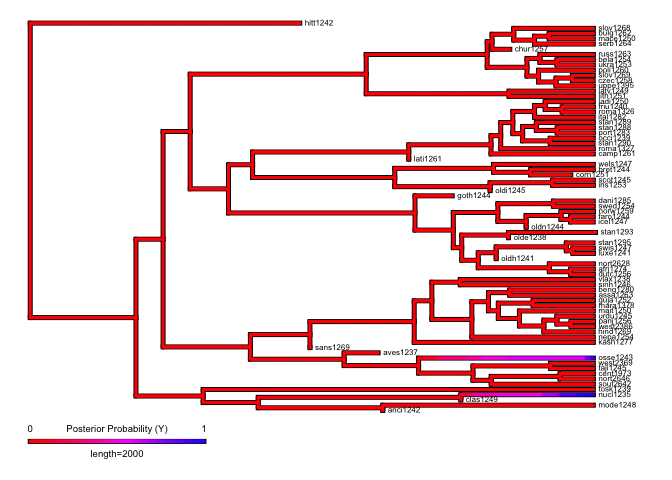
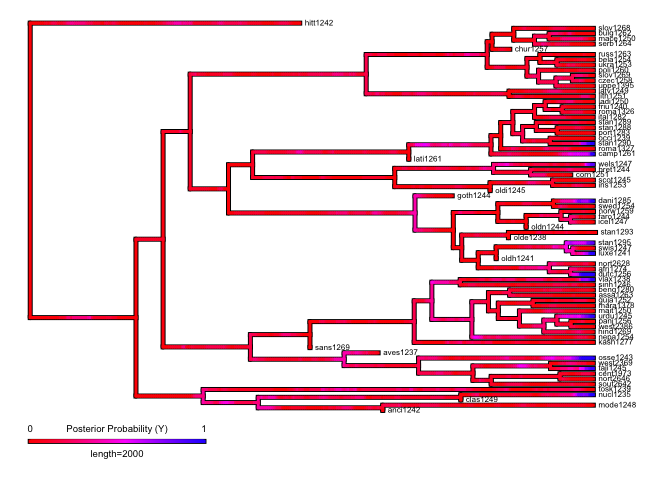
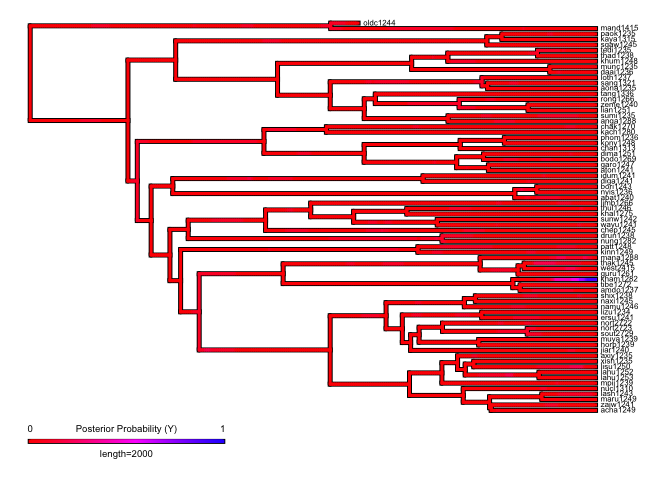

Plots for the phylogenetic study of ejectives and uvulars (presense /
absence) in IE and ST
================
Steven Moran

08 January, 2021

# Overview

We use [R](https://www.r-project.org/) \[@R\] and the following [R
packages](https://cran.r-project.org/web/packages/available_packages_by_name.html)
\[@dplyr;@ggtree;@ggplot2;@phytools;@phylotools\] in this script:

``` r
library(dplyr)
library(ggtree)
library(ggplot2) # http://bioconductor.org/packages/release/bioc/html/ggtree.html

library(phytools)
library(phylotools)
source('lib/functions.R')

load("../Harald/traits-harald.Rdata")
```

For each pruned phylogeny, we plot the trait coverage (has or does not
have ejectives and uvulars) and then we generate stochasic character
maps of each trait for each phylogeny.

Each phylogeny has been pruned for the data points that it contains in
PHOIBLE 2.0 \[@MoranMcCloy2019\]. The traits (presence or absence of
ejectives or uvulars) are then plotted as present (green) or not present
(red) in the languages represented in the phylogeny by their Glottocodes
\[@Hammarstrom\_etal2020\]).

To generate stochastic character maps
\[@Nielsen2002Mapping;@Huelsenbeck2003stochastic;@Revell2012phytools\],
we use the `phytools::make.simmap` function for an all rates different
(ARD) model where `q` is set to `empirical` (maximum probability, full
Bayesian MCMC) with 10 simulations.

Here is a convenient plot function.

``` r
# Define color schema
color.scheme <- c('blue','red')
names(color.scheme) <- c('Y','N')

# Function to reverse time in the plot
reverse.time <- function(p) { p$data$x <- p$data$x - max(p$data$x); return(p) }

# Create tree and heatmap figure
plot.tree <- function(pr_sum_tree_plot, features_plot) {
  gheatmap(pr_sum_tree_plot, features_plot,
           colnames_position='top', color='black',
           colnames_offset_y = 0.1, font.size = 2.5,
           width=0.4, offset = 8) +
    scale_fill_manual(name="", values=color.scheme) + 
    scale_x_continuous(breaks=c(-6000,-4000,-2000,0)) +
    scale_y_continuous(expand = c(-0.01, 1)) +
    theme_tree2(axis.text.x=element_text(size=8)) +
    theme(legend.position='none',  
          axis.ticks=element_line(color='grey'))
}
```

## Indo-European

The Indo-European phylogeny was published by
@Changetal2015Ancestry-constrained and is available in
[D-PLACE](https://github.com/D-PLACE/dplace-data) \[@kirby2016d\].

Here are the traits plotted on the pruned phylogeny.

``` r
load('trees/harald-ie-c-trees.Rdata')
traits.print <- pr_sum_tree$data %>% select(-taxa)
p <- reverse.time(ggtree(pr_sum_tree$tree, ladderize=T, right=T)) +
  geom_tiplab(align=T, linesize = .1, size = 2) 
plot.tree(p, traits.print)
```

<!-- -->

``` r
ggsave("figures/hh_distribution_ejectives_uvulars_ie.tiff", dpi=300, compression = 'lzw')
```

With this data, the IE pruned tree has this many data points:

``` r
nrow(pr_sum_tree$data)
```

    ## [1] 75

Here are the stochastic character maps.

For ejectives:

``` r
data <- pr_sum_tree$tree[["tip.label"]]
data <- data.matrix(data)

data <- pr_sum_tree$data[, "has_ejectives"]
names(data) <- pr_sum_tree$data$taxa

# Generate simmmap data: empirical = q has the maximum probablity; full bayesian = mcmc, pi=estimated
treemaps <- make.simmap(pr_sum_tree$tree, data, model="ARD", nsim=10, Q="empirical", pi="estimated")
```

    ## Using pi estimated from the stationary distribution of Q assuming a flat prior.
    ## pi =
    ##        N        Y 
    ## 0.959913 0.040087 
    ## 
    ## make.simmap is sampling character histories conditioned on
    ## the transition matrix
    ## 
    ## Q =
    ##               N            Y
    ## N -2.174259e-05 2.174259e-05
    ## Y  0.000000e+00 0.000000e+00
    ## (estimated using likelihood);
    ## and (mean) root node prior probabilities
    ## pi =
    ##            N            Y 
    ## 6.610696e-05 9.999339e-01

    ## Done.

``` r
# Plot simmap
map = densityMap(treemaps, plot=F, res=300)
```

    ## sorry - this might take a while; please be patient

``` r
map$cols[1:length(map$cols)] <- rev(map$cols[1:length(map$cols)])

# p <- plot(map, outline=T, lwd=c(3,3),
#          fsize=c(0.6,0.6), ftype='reg', 
#          legend=2000, leg.txt=c("0",paste0("Posterior Probability (Y)"),"1"))
# title(main="Ejectives")
# p

# Save figure for publication
tiff('figures/hh_simmap_ejectives_ie.tiff', res=300, compression = 'lzw', units="in", width=5.2, height=6)
plot(map,
     lwd=3,
     fsize=c(0.5,0.6), 
     ftype="reg",
     outline=TRUE,
     legend=2000,
     leg.txt=c("0", 
               paste0("Posterior Probability (Y)"),"1"))
# par(mar=c(5.1,4.1,4.1,2.1))
dev.off()
```

    ## quartz_off_screen 
    ##                 2

``` r
plot(map,
     lwd=3,
     fsize=c(0.5,0.6), 
     ftype="reg",
     outline=TRUE,
     legend=2000,
     leg.txt=c("0", 
               paste0("Posterior Probability (Y)"),"1"))
```

<!-- -->

For uvulars:

``` r
data <- pr_sum_tree$tree[["tip.label"]]
data <- data.matrix(data)

data <- pr_sum_tree$data[, "has_uvulars"]
names(data) <- pr_sum_tree$data$taxa

# Generate simmmap data: empirical = q has the maximum probablity; full bayesian = mcmc, pi=estimated
treemaps <- make.simmap(pr_sum_tree$tree, data, model="ARD", nsim=10, Q="empirical", pi="estimated")
```

    ## Using pi estimated from the stationary distribution of Q assuming a flat prior.
    ## pi =
    ##        N        Y 
    ## 0.840553 0.159447 
    ## 
    ## make.simmap is sampling character histories conditioned on
    ## the transition matrix
    ## 
    ## Q =
    ##               N             Y
    ## N -0.0009776741  0.0009776741
    ## Y  0.0051540119 -0.0051540119
    ## (estimated using likelihood);
    ## and (mean) root node prior probabilities
    ## pi =
    ##         N         Y 
    ## 0.8405538 0.1594462

    ## Done.

``` r
# Plot simmap
map = densityMap(treemaps, plot=F, res=300)
```

    ## sorry - this might take a while; please be patient

``` r
map$cols[1:length(map$cols)] <- rev(map$cols[1:length(map$cols)])

#p <- plot(map, outline=T, lwd=c(3,3),
#          fsize=c(0.6,0.6), ftype='reg', 
#          legend=2000, leg.txt=c("0",paste0("Posterior Probability (Y)"),"1"))
#title(main="Uvulars")
#p

# Save figure for publication
tiff('figures/hh_simmap_uvulars_ie.tiff', res=300, compression = 'lzw', units="in", width=5.2, height=6)
plot(map,
     lwd=3,
     fsize=c(0.5,0.6), 
     ftype="reg",
     outline=TRUE,
     legend=2000,
     leg.txt=c("0", 
               paste0("Posterior Probability (Y)"),"1"))
# par(mar=c(5.1,4.1,4.1,2.1))
dev.off()
```

    ## quartz_off_screen 
    ##                 2

``` r
plot(map,
     lwd=3,
     fsize=c(0.5,0.6), 
     ftype="reg",
     outline=TRUE,
     legend=2000,
     leg.txt=c("0", 
               paste0("Posterior Probability (Y)"),"1"))
```

<!-- -->

## Sino-Tibetan

The Sino-Tibetan phylogeny was published by @Zhang2019 and is available
in [D-PLACE](https://github.com/D-PLACE/dplace-data) \[@kirby2016d\].

Here are the traits plotted on the pruned phylogeny.

``` r
load('trees/harald-sinotibetan-z-trees.Rdata')
traits.print <- pr_sum_tree$data %>% select(-taxa)
p <- reverse.time(ggtree(pr_sum_tree$tree, ladderize=T, right=T)) +
  geom_tiplab(align=T, linesize = .1, size = 2) 
plot.tree(p, traits.print)
```

<!-- -->

``` r
ggsave("figures/hh_distribution_ejectives_uvulars_st.tiff", dpi=300, compression = 'lzw')
```

With this data, the ST pruned tree has this many data points:

``` r
nrow(pr_sum_tree$data)
```

    ## [1] 72

``` r
data <- pr_sum_tree$tree[["tip.label"]]
data <- data.matrix(data)

data <- pr_sum_tree$data[, "has_ejectives"]
names(data) <- pr_sum_tree$data$taxa

# Generate simmmap data: empirical = q has the maximum probablity; full bayesian = mcmc, pi=estimated
treemaps <- make.simmap(pr_sum_tree$tree, data, model="ARD", nsim=10, Q="empirical", pi="estimated")
```

    ## Using pi estimated from the stationary distribution of Q assuming a flat prior.
    ## pi =
    ##        N        Y 
    ## 0.986109 0.013891 
    ## 
    ## make.simmap is sampling character histories conditioned on
    ## the transition matrix
    ## 
    ## Q =
    ##               N             Y
    ## N -8.166243e-05  8.166243e-05
    ## Y  5.797295e-03 -5.797295e-03
    ## (estimated using likelihood);
    ## and (mean) root node prior probabilities
    ## pi =
    ##          N          Y 
    ## 0.98610937 0.01389063

    ## Done.

``` r
# Plot simmap
map = densityMap(treemaps, plot=F, res=300)
```

    ## sorry - this might take a while; please be patient

``` r
map$cols[1:length(map$cols)] <- rev(map$cols[1:length(map$cols)])

#p <- plot(map, outline=T, lwd=c(3,3),
#          fsize=c(0.6,0.6), ftype='reg', 
#          legend=2000, leg.txt=c("0",paste0("Posterior Probability (Y)"),"1"))
#title(main="Ejectives")
#p

# Save figure for publication
tiff('figures/hh_simmap_ejectives_st.tiff', res=300, compression = 'lzw', units="in", width=5.2, height=6)
plot(map,
     lwd=3,
     fsize=c(0.5,0.6), 
     ftype="reg",
     outline=TRUE,
     legend=2000,
     leg.txt=c("0", 
               paste0("Posterior Probability (Y)"),"1"))
# par(mar=c(5.1,4.1,4.1,2.1))
dev.off()
```

    ## quartz_off_screen 
    ##                 2

``` r
plot(map,
     lwd=3,
     fsize=c(0.5,0.6), 
     ftype="reg",
     outline=TRUE,
     legend=2000,
     leg.txt=c("0", 
               paste0("Posterior Probability (Y)"),"1"))
```

<!-- -->

For uvulars:

``` r
data <- pr_sum_tree$tree[["tip.label"]]
data <- data.matrix(data)

data <- pr_sum_tree$data[, "has_uvulars"]
names(data) <- pr_sum_tree$data$taxa

# Generate simmmap data: empirical = q has the maximum probablity; full bayesian = mcmc, pi=estimated
treemaps <- make.simmap(pr_sum_tree$tree, data, model="ARD", nsim=10, Q="empirical", pi="estimated")
```

    ## Using pi estimated from the stationary distribution of Q assuming a flat prior.
    ## pi =
    ##        N        Y 
    ## 0.831917 0.168083 
    ## 
    ## make.simmap is sampling character histories conditioned on
    ## the transition matrix
    ## 
    ## Q =
    ##               N             Y
    ## N -3.795521e-05  3.795521e-05
    ## Y  1.803341e-04 -1.803341e-04
    ## (estimated using likelihood);
    ## and (mean) root node prior probabilities
    ## pi =
    ##         N         Y 
    ## 0.8261243 0.1738757

    ## Done.

``` r
# Plot simmap
map = densityMap(treemaps, plot=F, res=300)
```

    ## sorry - this might take a while; please be patient

``` r
map$cols[1:length(map$cols)] <- rev(map$cols[1:length(map$cols)])

#p <- plot(map, outline=T, lwd=c(3,3),
#          fsize=c(0.6,0.6), ftype='reg', 
#          legend=2000, leg.txt=c("0",paste0("Posterior Probability (Y)"),"1"))
#title(main="Uvulars")
#p

tiff('figures/hh_simmap_uvulars_st.tiff', res=300, compression = 'lzw', units="in", width=5.2, height=6)
plot(map,
     lwd=3,
     fsize=c(0.5,0.6), 
     ftype="reg",
     outline=TRUE,
     legend=2000,
     leg.txt=c("0", 
               paste0("Posterior Probability (Y)"),"1"))
# par(mar=c(5.1,4.1,4.1,2.1))
dev.off()
```

    ## quartz_off_screen 
    ##                 2

``` r
plot(map,
     lwd=3,
     fsize=c(0.5,0.6), 
     ftype="reg",
     outline=TRUE,
     legend=2000,
     leg.txt=c("0", 
               paste0("Posterior Probability (Y)"),"1"))
```

<!-- -->
