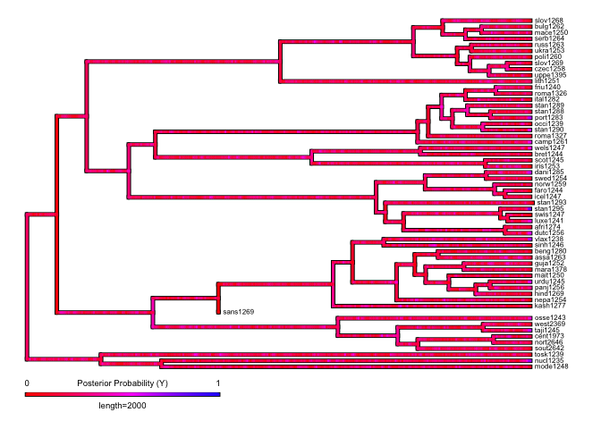
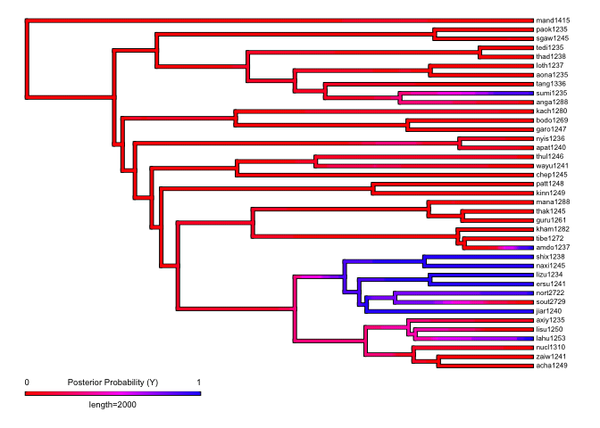

Phylogenetic study of ejectives and uvulars (presense / absence) in IE
and ST
================
Steven Moran
21 September, 2020

Analyses
========

For each prune phylogeny we plot the trait coverage (has or does not
have ejectives and uvulars) and then we generate stochasic character
maps of each trait for each phylogeny.

Each phylogeny has been pruned for the data points that it contains in
PHOIBLE 2.0 (Moran & McCloy, 2019). The traits (presence or absence of
ejectives or uvulars) in are then plotted as present (green) or not
present (red) in the languages represented in the phylogeny by
Glottocodes (Hammarström et al, 2020).

References

-   Moran, Steven & McCloy, Daniel (eds.) 2019.PHOIBLE 2.0. Jena: Max
    Planck Institute for the Science of Human History. (Available online
    at <a href="http://phoible.org" class="uri">http://phoible.org</a>,
    Accessed on 2020-05-16.)

-   Hammarström, Harald & Forkel, Robert & Haspelmath, Martin & Bank,
    Sebastian. 2020. Glottolog 4.2.1. Jena: Max Planck Institute for the
    Science of Human History. (Available online at
    <a href="http://glottolog.org" class="uri">http://glottolog.org</a>,
    Accessed on 2020-05-16.)

To generate stochastic character maps (Nielsen, 2002; Huelsenbeck et.
al, 2003; Revell, 20120) we use the `phytools::make.simmap` function for
an all rates different (ARD) model where `q` is set to `empirical`
(maximum probability, full Bayesian MCMC) with 10 simulations on the
ACQDIV phonology data.

References

-   R. Nielsen, Mapping mutations on phylogenies. Syst. Biol. 51,
    729–739 (2002). doi: 10.1080/10635150290102393; pmid: 12396587

-   J. P. Huelsenbeck, R. Nielsen, J. P. Bollback, Stochastic mapping of
    morphological characters. Syst. Biol. 52, 131–158 (2003). doi:
    10.1080/10635150390192780; pmid: 12746144

-   L. J. Revell, phytools: An R package for phylogenetic comparative
    biology (and other things). Methods Ecol. Evol. 3, 217–223 (2012).
    doi: 10.1111/j.2041-210X.2011.00169.x

<!-- -->

    library(dplyr)
    library(ggtree)
    library(ggplot2) # http://bioconductor.org/packages/release/bioc/html/ggtree.html

    library(phytools)
    library(phylotools)
    source('lib/functions.R')

    load("trees/traits.Rdata")

Plot function.

    # Define color schema
    color.scheme <- c('blue','red')
    names(color.scheme) <- c('Y','N')

    # Function to reverse time in the plot
    reverse.time <- function(p) { p$data$x <- p$data$x - max(p$data$x); return(p) }

    # Create tree and heatmap figure
    plot.tree <- function(pr_sum_tree_plot, features_plot) {
      gheatmap(pr_sum_tree_plot, features_plot,
               colnames_position='top', color='black',
               colnames_offset_y = 0.1, font.size = 2.5,
               width=0.4, offset = 8) +
        scale_fill_manual(name="", values=color.scheme) + 
        scale_x_continuous(breaks=c(-6000,-4000,-2000,0)) +
        scale_y_continuous(expand = c(-0.01, 1)) +
        theme_tree2(axis.text.x=element_text(size=8)) +
        theme(legend.position='none',  
              axis.ticks=element_line(color='grey'))
    }

Indo-European
-------------

The phylogeny comes from:

-   Chang W, Cathcart C, Hall D, & Garrett A. 2015. Ancestry-constrained
    phylogenetic analysis supports the Indo-European steppe hypothesis.
    Language, 91(1):194-244.

Here are the traits plotted on the pruned phylogeny.

    load('trees/ie-c-trees.Rdata')
    traits.print <- pr_sum_tree$data %>% select(-taxa)
    p <- reverse.time(ggtree(pr_sum_tree$tree, ladderize=T, right=T)) +
      geom_tiplab(align=T, linesize = .1, size = 2) 
    plot.tree(p, traits.print)

<!-- -->

With this data, the IE pruned tree has this many data points:

    nrow(pr_sum_tree$data)

    ## [1] 58

Here are the stochastic character maps.

For ejectives:

    data <- pr_sum_tree$tree[["tip.label"]]
    data <- data.matrix(data)

    data <- pr_sum_tree$data[, "has_ejectives"]
    names(data) <- pr_sum_tree$data$taxa

    # Generate simmmap data: empirical = q has the maximum probablity; full bayesian = mcmc, pi=estimated
    treemaps <- make.simmap(pr_sum_tree$tree, data, model="ARD", nsim=10, Q="empirical", pi="estimated")

    ## Using pi estimated from the stationary distribution of Q assuming a flat prior.
    ## pi =
    ##        N        Y 
    ## 0.939401 0.060599 
    ## 
    ## make.simmap is sampling character histories conditioned on the transition matrix
    ## 
    ## Q =
    ##               N            Y
    ## N -2.431031e-05 2.431031e-05
    ## Y  0.000000e+00 0.000000e+00
    ## (estimated using likelihood);
    ## and (mean) root node prior probabilities
    ## pi =
    ##            N            Y 
    ## 6.610696e-05 9.999339e-01

    ## Done.

    # Plot simmap
    map = densityMap(treemaps, plot=F, res=300)

    ## sorry - this might take a while; please be patient

    map$cols[1:length(map$cols)] <- rev(map$cols[1:length(map$cols)])
    p <- plot(map, outline=T, lwd=c(3,3),
              fsize=c(0.6,0.6), ftype='reg', 
              legend=2000, leg.txt=c("0",paste0("Posterior Probability (Y)"),"1"))
    title(main="Ejectives")

<!-- -->

    p

    ## [1] 0

For uvulars:

    data <- pr_sum_tree$tree[["tip.label"]]
    data <- data.matrix(data)

    data <- pr_sum_tree$data[, "has_uvulars"]
    names(data) <- pr_sum_tree$data$taxa

    # Generate simmmap data: empirical = q has the maximum probablity; full bayesian = mcmc, pi=estimated
    treemaps <- make.simmap(pr_sum_tree$tree, data, model="ARD", nsim=10, Q="empirical", pi="estimated")

    ## Using pi estimated from the stationary distribution of Q assuming a flat prior.
    ## pi =
    ##        N        Y 
    ## 0.775862 0.224138 
    ## 
    ## make.simmap is sampling character histories conditioned on the transition matrix
    ## 
    ## Q =
    ##             N           Y
    ## N -0.03376302  0.03376302
    ## Y  0.11687165 -0.11687165
    ## (estimated using likelihood);
    ## and (mean) root node prior probabilities
    ## pi =
    ##         N         Y 
    ## 0.7758615 0.2241385

    ## Done.

    # Plot simmap
    map = densityMap(treemaps, plot=F, res=300)

    ## sorry - this might take a while; please be patient

    map$cols[1:length(map$cols)] <- rev(map$cols[1:length(map$cols)])
    p <- plot(map, outline=T, lwd=c(3,3),
              fsize=c(0.6,0.6), ftype='reg', 
              legend=2000, leg.txt=c("0",paste0("Posterior Probability (Y)"),"1"))
    title(main="Uvulars")

<!-- -->

    p

    ## [1] 0

Sino-Tibetan
------------

Phylogeny comes from:

-   Zhang M, Yan S, Pan W, & Jin L. 2019. Phylogenetic evidence for
    Sino-Tibetan origin in northern China in the Late Neolithic. Nature,
    569, 112-115.

Here are the traits plotted on the pruned phylogeny.

    load('trees/sinotibetan-z-trees.Rdata')
    traits.print <- pr_sum_tree$data %>% select(-taxa)
    p <- reverse.time(ggtree(pr_sum_tree$tree, ladderize=T, right=T)) +
      geom_tiplab(align=T, linesize = .1, size = 2) 
    plot.tree(p, traits.print)

<!-- -->

With this data, the ST pruned tree has this many data points:

    nrow(pr_sum_tree$data)

    ## [1] 39

    data <- pr_sum_tree$tree[["tip.label"]]
    data <- data.matrix(data)

    data <- pr_sum_tree$data[, "has_ejectives"]
    names(data) <- pr_sum_tree$data$taxa

    # Generate simmmap data: empirical = q has the maximum probablity; full bayesian = mcmc, pi=estimated
    treemaps <- make.simmap(pr_sum_tree$tree, data, model="ARD", nsim=10, Q="empirical", pi="estimated")

    ## Using pi estimated from the stationary distribution of Q assuming a flat prior.
    ## pi =
    ##        N        Y 
    ## 0.974359 0.025641 
    ## 
    ## make.simmap is sampling character histories conditioned on the transition matrix
    ## 
    ## Q =
    ##              N            Y
    ## N -0.000228327  0.000228327
    ## Y  0.008676336 -0.008676336
    ## (estimated using likelihood);
    ## and (mean) root node prior probabilities
    ## pi =
    ##          N          Y 
    ## 0.97435872 0.02564128

    ## Done.

    # Plot simmap
    map = densityMap(treemaps, plot=F, res=300)

    ## sorry - this might take a while; please be patient

    map$cols[1:length(map$cols)] <- rev(map$cols[1:length(map$cols)])
    p <- plot(map, outline=T, lwd=c(3,3),
              fsize=c(0.6,0.6), ftype='reg', 
              legend=2000, leg.txt=c("0",paste0("Posterior Probability (Y)"),"1"))
    title(main="Ejectives")

<!-- -->

    p

    ## [1] 0

For uvulars:

    data <- pr_sum_tree$tree[["tip.label"]]
    data <- data.matrix(data)

    data <- pr_sum_tree$data[, "has_uvulars"]
    names(data) <- pr_sum_tree$data$taxa

    # Generate simmmap data: empirical = q has the maximum probablity; full bayesian = mcmc, pi=estimated
    treemaps <- make.simmap(pr_sum_tree$tree, data, model="ARD", nsim=10, Q="empirical", pi="estimated")

    ## Using pi estimated from the stationary distribution of Q assuming a flat prior.
    ## pi =
    ##        N        Y 
    ## 0.820186 0.179814 
    ## 
    ## make.simmap is sampling character histories conditioned on the transition matrix
    ## 
    ## Q =
    ##               N             Y
    ## N -6.600788e-05  6.600788e-05
    ## Y  2.318698e-04 -2.318698e-04
    ## (estimated using likelihood);
    ## and (mean) root node prior probabilities
    ## pi =
    ##         N         Y 
    ## 0.7784061 0.2215939

    ## Done.

    # Plot simmap
    map = densityMap(treemaps, plot=F, res=300)

    ## sorry - this might take a while; please be patient

    map$cols[1:length(map$cols)] <- rev(map$cols[1:length(map$cols)])
    p <- plot(map, outline=T, lwd=c(3,3),
              fsize=c(0.6,0.6), ftype='reg', 
              legend=2000, leg.txt=c("0",paste0("Posterior Probability (Y)"),"1"))
    title(main="Uvulars")

<!-- -->

    p

    ## [1] 0
