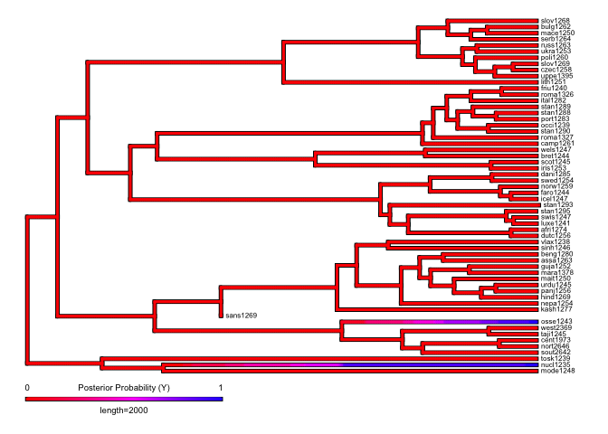

Plots for the phylogenetic study of ejectives and uvulars (presense /
absence) in IE and ST
================
Steven Moran

08 January, 2021

# Overview

We use [R](https://www.r-project.org/) (R Core Team 2020) and the
following [R
packages](https://cran.r-project.org/web/packages/available_packages_by_name.html)
(Wickham et al. 2020; Yu et al. 2017; Wickham 2016; Revell 2012b; J.
Zhang 2017) in this script:

``` r
library(dplyr)
library(ggtree)
library(ggplot2) # http://bioconductor.org/packages/release/bioc/html/ggtree.html

library(phytools)
library(phylotools)
source('lib/functions.R')

load("trees/traits.Rdata")
```

For each pruned phylogeny, we plot the trait coverage (has or does not
have ejectives and uvulars) and then we generate stochasic character
maps of each trait for each phylogeny.

Each phylogeny has been pruned for the data points that it contains in
PHOIBLE 2.0 (Moran and McCloy 2019). The traits (presence or absence of
ejectives or uvulars) are then plotted as present (green) or not present
(red) in the languages represented in the phylogeny by their Glottocodes
(Hammarström et al. 2020)).

To generate stochastic character maps (Nielsen 2002; Huelsenbeck,
Nielsen, and Bollback 2003; Revell 2012a), we use the
`phytools::make.simmap` function for an all rates different (ARD) model
where `q` is set to `empirical` (maximum probability, full Bayesian
MCMC) with 10 simulations.

Here is a convenient plot function.

``` r
# Define color schema
color.scheme <- c('blue','red')
names(color.scheme) <- c('Y','N')

# Function to reverse time in the plot
reverse.time <- function(p) { p$data$x <- p$data$x - max(p$data$x); return(p) }

# Create tree and heatmap figure
plot.tree <- function(pr_sum_tree_plot, features_plot) {
  gheatmap(pr_sum_tree_plot, features_plot,
           colnames_position='top', color='black',
           colnames_offset_y = 0.1, font.size = 2.5,
           width=0.4, offset = 8) +
    scale_fill_manual(name="", values=color.scheme) + 
    scale_x_continuous(breaks=c(-6000,-4000,-2000,0)) +
    scale_y_continuous(expand = c(-0.01, 1)) +
    theme_tree2(axis.text.x=element_text(size=8)) +
    theme(legend.position='none',  
          axis.ticks=element_line(color='grey'))
}
```

## Indo-European

The Indo-European phylogeny was published by Chang et al. (2015) and is
available in [D-PLACE](https://github.com/D-PLACE/dplace-data) (Kirby et
al. 2016).

Here are the traits plotted on the pruned phylogeny.

``` r
load('trees/ie-c-trees.Rdata')
traits.print <- pr_sum_tree$data %>% select(-taxa)

p <- reverse.time(ggtree(pr_sum_tree$tree, ladderize=T, right=T)) +
  geom_tiplab(align=T, linesize = .1, size = 2) 
plot.tree(p, traits.print)
```

<!-- -->

``` r
ggsave("figures/distribution_ejectives_uvulars_ie.tiff", dpi=300, compression = 'lzw')
```

With this data, the IE pruned tree has this many data points:

``` r
nrow(pr_sum_tree$data)
```

    ## [1] 58

Here are the stochastic character maps.

For ejectives:

``` r
data <- pr_sum_tree$tree[["tip.label"]]
data <- data.matrix(data)

data <- pr_sum_tree$data[, "has_ejectives"]
names(data) <- pr_sum_tree$data$taxa

# Generate simmmap data: empirical = q has the maximum probablity; full bayesian = mcmc, pi=estimated
treemaps <- make.simmap(pr_sum_tree$tree, data, model="ARD", nsim=10, Q="empirical", pi="estimated")
```

    ## Using pi estimated from the stationary distribution of Q assuming a flat prior.
    ## pi =
    ##        N        Y 
    ## 0.939401 0.060599 
    ## 
    ## make.simmap is sampling character histories conditioned on
    ## the transition matrix
    ## 
    ## Q =
    ##               N            Y
    ## N -2.431031e-05 2.431031e-05
    ## Y  0.000000e+00 0.000000e+00
    ## (estimated using likelihood);
    ## and (mean) root node prior probabilities
    ## pi =
    ##            N            Y 
    ## 6.610696e-05 9.999339e-01

    ## Done.

``` r
# Plot simmap
map = densityMap(treemaps, plot=FALSE, res=300)
```

    ## sorry - this might take a while; please be patient

``` r
map$cols[1:length(map$cols)] <- rev(map$cols[1:length(map$cols)])

# Save figure for publication
tiff('figures/simmap_ejectives_ie.tiff', res=300, compression = 'lzw', units="in", width=5.2, height=6)
plot(map,
     lwd=3,
     fsize=c(0.5,0.6), 
     ftype="reg",
     outline=TRUE,
     legend=2000,
     leg.txt=c("0", 
               paste0("Posterior Probability (Y)"),"1"))
# par(mar=c(5.1,4.1,4.1,2.1))
dev.off()
```

    ## quartz_off_screen 
    ##                 2

``` r
plot(map,
     lwd=3,
     fsize=c(0.5,0.6), 
     ftype="reg",
     outline=TRUE,
     legend=2000,
     leg.txt=c("0", 
               paste0("Posterior Probability (Y)"),"1"))
```

<!-- -->

For uvulars:

``` r
data <- pr_sum_tree$tree[["tip.label"]]
data <- data.matrix(data)

data <- pr_sum_tree$data[, "has_uvulars"]
names(data) <- pr_sum_tree$data$taxa

# Generate simmmap data: empirical = q has the maximum probablity; full bayesian = mcmc, pi=estimated
treemaps <- make.simmap(pr_sum_tree$tree, data, model="ARD", nsim=10, Q="empirical", pi="estimated")
```

    ## Using pi estimated from the stationary distribution of Q assuming a flat prior.
    ## pi =
    ##        N        Y 
    ## 0.775862 0.224138 
    ## 
    ## make.simmap is sampling character histories conditioned on
    ## the transition matrix
    ## 
    ## Q =
    ##             N           Y
    ## N -0.03376302  0.03376302
    ## Y  0.11687165 -0.11687165
    ## (estimated using likelihood);
    ## and (mean) root node prior probabilities
    ## pi =
    ##         N         Y 
    ## 0.7758615 0.2241385

    ## Done.

``` r
# Plot simmap
map = densityMap(treemaps, plot=F, res=300)
```

    ## sorry - this might take a while; please be patient

``` r
map$cols[1:length(map$cols)] <- rev(map$cols[1:length(map$cols)])

#p <- plot(map, outline=T, lwd=c(3,3),
#          fsize=c(0.6,0.6), ftype='reg', 
#          legend=2000, leg.txt=c("0",paste0("Posterior Probability (Y)"),"1"))
#title(main="Uvulars")
#p

# Save figure for publication
tiff('figures/simmap_uvulars_ie.tiff', res=300, compression = 'lzw', units="in", width=5.2, height=6)
plot(map,
     lwd=3,
     fsize=c(0.5,0.6), 
     ftype="reg",
     outline=TRUE,
     legend=2000,
     leg.txt=c("0", 
               paste0("Posterior Probability (Y)"),"1"))
# par(mar=c(5.1,4.1,4.1,2.1))
dev.off()
```

    ## quartz_off_screen 
    ##                 2

``` r
plot(map,
     lwd=3,
     fsize=c(0.5,0.6), 
     ftype="reg",
     outline=TRUE,
     legend=2000,
     leg.txt=c("0", 
               paste0("Posterior Probability (Y)"),"1"))
```

<!-- -->

## Sino-Tibetan

The Sino-Tibetan phylogeny was published by M. Zhang et al. (2019) and
is available in [D-PLACE](https://github.com/D-PLACE/dplace-data) (Kirby
et al. 2016).

Here are the traits plotted on the pruned phylogeny.

``` r
load('trees/sinotibetan-z-trees.Rdata')
traits.print <- pr_sum_tree$data %>% select(-taxa)
p <- reverse.time(ggtree(pr_sum_tree$tree, ladderize=T, right=T)) +
  geom_tiplab(align=T, linesize = .1, size = 2) 
plot.tree(p, traits.print)
```

<!-- -->

``` r
ggsave("figures/distribution_ejectives_uvulars_st.tiff", dpi=300, compression = 'lzw')
```

With this data, the ST pruned tree has this many data points:

``` r
nrow(pr_sum_tree$data)
```

    ## [1] 39

``` r
data <- pr_sum_tree$tree[["tip.label"]]
data <- data.matrix(data)

data <- pr_sum_tree$data[, "has_ejectives"]
names(data) <- pr_sum_tree$data$taxa

# Generate simmmap data: empirical = q has the maximum probablity; full bayesian = mcmc, pi=estimated
treemaps <- make.simmap(pr_sum_tree$tree, data, model="ARD", nsim=10, Q="empirical", pi="estimated")
```

    ## Using pi estimated from the stationary distribution of Q assuming a flat prior.
    ## pi =
    ##        N        Y 
    ## 0.974359 0.025641 
    ## 
    ## make.simmap is sampling character histories conditioned on
    ## the transition matrix
    ## 
    ## Q =
    ##              N            Y
    ## N -0.000228327  0.000228327
    ## Y  0.008676336 -0.008676336
    ## (estimated using likelihood);
    ## and (mean) root node prior probabilities
    ## pi =
    ##          N          Y 
    ## 0.97435872 0.02564128

    ## Done.

``` r
# Plot simmap
map = densityMap(treemaps, plot=F, res=300)
```

    ## sorry - this might take a while; please be patient

``` r
map$cols[1:length(map$cols)] <- rev(map$cols[1:length(map$cols)])

#p <- plot(map, outline=T, lwd=c(3,3),
#          fsize=c(0.6,0.6), ftype='reg', 
#          legend=2000, leg.txt=c("0",paste0("Posterior Probability (Y)"),"1"))
#title(main="Ejectives")
#p

# Save figure for publication
tiff('figures/simmap_ejectives_st.tiff', res=300, compression = 'lzw', units="in", width=5.2, height=6)
plot(map,
     lwd=3,
     fsize=c(0.5,0.6), 
     ftype="reg",
     outline=TRUE,
     legend=2000,
     leg.txt=c("0", 
               paste0("Posterior Probability (Y)"),"1"))
# par(mar=c(5.1,4.1,4.1,2.1))
dev.off()
```

    ## quartz_off_screen 
    ##                 2

``` r
plot(map,
     lwd=3,
     fsize=c(0.5,0.6), 
     ftype="reg",
     outline=TRUE,
     legend=2000,
     leg.txt=c("0", 
               paste0("Posterior Probability (Y)"),"1"))
```

<!-- -->

For uvulars:

``` r
data <- pr_sum_tree$tree[["tip.label"]]
data <- data.matrix(data)

data <- pr_sum_tree$data[, "has_uvulars"]
names(data) <- pr_sum_tree$data$taxa

# Generate simmmap data: empirical = q has the maximum probablity; full bayesian = mcmc, pi=estimated
treemaps <- make.simmap(pr_sum_tree$tree, data, model="ARD", nsim=10, Q="empirical", pi="estimated")
```

    ## Using pi estimated from the stationary distribution of Q assuming a flat prior.
    ## pi =
    ##        N        Y 
    ## 0.820186 0.179814 
    ## 
    ## make.simmap is sampling character histories conditioned on
    ## the transition matrix
    ## 
    ## Q =
    ##               N             Y
    ## N -6.600788e-05  6.600788e-05
    ## Y  2.318698e-04 -2.318698e-04
    ## (estimated using likelihood);
    ## and (mean) root node prior probabilities
    ## pi =
    ##         N         Y 
    ## 0.7784061 0.2215939

    ## Done.

``` r
# Plot simmap
map = densityMap(treemaps, plot=F, res=300)
```

    ## sorry - this might take a while; please be patient

``` r
map$cols[1:length(map$cols)] <- rev(map$cols[1:length(map$cols)])

#p <- plot(map, outline=T, lwd=c(3,3),
#          fsize=c(0.6,0.6), ftype='reg', 
#          legend=2000, leg.txt=c("0",paste0("Posterior Probability (Y)"),"1"))
#title(main="Uvulars")
# p

# Save figure for publication
tiff('figures/simmap_uvulars_st.tiff', res=300, compression = 'lzw', units="in", width=5.2, height=6)
plot(map,
     lwd=3,
     fsize=c(0.5,0.6), 
     ftype="reg",
     outline=TRUE,
     legend=2000,
     leg.txt=c("0", 
               paste0("Posterior Probability (Y)"),"1"))
# par(mar=c(5.1,4.1,4.1,2.1))
dev.off()
```

    ## quartz_off_screen 
    ##                 2

``` r
plot(map,
     lwd=3,
     fsize=c(0.5,0.6), 
     ftype="reg",
     outline=TRUE,
     legend=2000,
     leg.txt=c("0", 
               paste0("Posterior Probability (Y)"),"1"))
```

<!-- -->

# References

<div id="refs" class="references csl-bib-body hanging-indent">

<div id="ref-Changetal2015Ancestry-constrained" class="csl-entry">

Chang, Will, Chundra Cathcart, David Hall, and Andrew Garrett. 2015.
“Ancestry-Constrained Phylogenetic Analysis Supports Indo-European
Steppe Hypothesis.” *Language* 91: 194–244.
<https://doi.org/10.1353/lan.2015.0005>.

</div>

<div id="ref-Hammarstrom_etal2020" class="csl-entry">

Hammarström, Harald, Robert Forkel, Martin Haspelmath, and Sebastian
Bank. 2020. *Glottolog 4.2.1*. Jena: Max Planck Institute for the
Science of Human History. <https://doi.org/10.5281/zenodo.3754591>.

</div>

<div id="ref-Huelsenbeck2003stochastic" class="csl-entry">

Huelsenbeck, John P, Rasmus Nielsen, and Jonathan P Bollback. 2003.
“Stochastic Mapping of Morphological Characters.” *Systematic Biology*
52 (2): 131–58. <https://doi.org/10.1080/10635150390192780>.

</div>

<div id="ref-kirby2016d" class="csl-entry">

Kirby, Kathryn R., Russell D. Gray, Simon J. Greenhill, Fiona M. Jordan,
Stephanie Gomes-Ng, Hans-Jörg Bibiko, Damián E. Blasi, et al. 2016.
“D-PLACE: A Global Database of Cultural, Linguistic and Environmental
Diversity.” *PLoS ONE* 11 (7): e0158391.

</div>

<div id="ref-MoranMcCloy2019" class="csl-entry">

Moran, Steven, and Daniel McCloy, eds. 2019. *PHOIBLE 2.0*. Jena: Max
Planck Institute for the Science of Human History.
<https://doi.org/10.5281/zenodo.2562766>.

</div>

<div id="ref-Nielsen2002Mapping" class="csl-entry">

Nielsen, Rasmus. 2002. “Mapping Mutations on Phylogenies.” *Systematic
Biology* 51: 729–32. <https://doi.org/10.1080/10635150290102393>.

</div>

<div id="ref-R" class="csl-entry">

R Core Team. 2020. *R: A Language and Environment for Statistical
Computing*. Vienna, Austria: R Foundation for Statistical Computing.
<https://www.R-project.org/>.

</div>

<div id="ref-Revell2012phytools" class="csl-entry">

Revell, Liam J. 2012a. “`phytools`: An R Package for Phylogenetic
Comparative Biology (and Other Things).” *Methods in Ecology and
Evolution* 3: 217–23.

</div>

<div id="ref-phytools" class="csl-entry">

———. 2012b. “Phytools: An r Package for Phylogenetic Comparative Biology
(and Other Things).” *Methods in Ecology and Evolution* 3: 217–23.

</div>

<div id="ref-ggplot2" class="csl-entry">

Wickham, Hadley. 2016. *Ggplot2: Elegant Graphics for Data Analysis*.
Springer-Verlag New York. <https://ggplot2.tidyverse.org>.

</div>

<div id="ref-dplyr" class="csl-entry">

Wickham, Hadley, Romain François, Lionel Henry, and Kirill Müller. 2020.
*Dplyr: A Grammar of Data Manipulation*.
<https://CRAN.R-project.org/package=dplyr>.

</div>

<div id="ref-ggtree" class="csl-entry">

Yu, Guangchuang, David K Smith, Huachen Zhu, Yi Guan, and Tommy Tsan-Yuk
Lam. 2017. “Ggtree: An r Package for Visualization and Annotation of
Phylogenetic Trees with Their Covariates and Other Associated Data.”
*Methods in Ecology and Evolution* 8 (1): 28–36.

</div>

<div id="ref-phylotools" class="csl-entry">

Zhang, Jinlong. 2017. *Phylotools: Phylogenetic Tools for
Eco-Phylogenetics*. <https://CRAN.R-project.org/package=phylotools>.

</div>

<div id="ref-Zhang2019" class="csl-entry">

Zhang, Menghan, Shi Yan, Wuyun Pan, and Li Jin. 2019. “Phylogenetic
Evidence for Sino-Tibetan Origin in Northern China in the Late
Neolithic.” *Nature* 569 (7754): 112–15.
<https://doi.org/10.1038/s41586-019-1153-z>.

</div>

</div>
